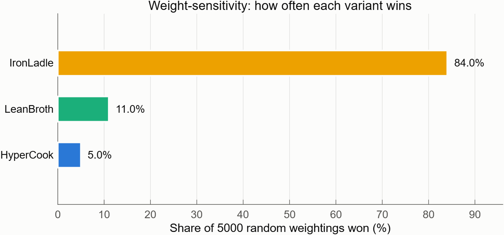

# Intergalactic Vegan Soup Factory

A space-based vegan soup production facility, modeled end-to-end using a full **RFLP** (Requirements–Functional–Logical–Physical) architecture in MathWorks System Composer.

The facility receives ingredient deliveries by rocket, stores and prepares them, cooks soup at scale, performs quality assurance, packages the result for interstellar transit, and dispatches it to customers across the galaxy — all under tight mass, power, cost, and volume budgets, across a wide range of ambient gravity conditions, with a five-being crew.

## Toolchain

| Tool | Version |
|---|---|
| MATLAB | R2026a |
| System Composer | R2026a |
| Requirements Toolbox | R2026a |

## Folder structure

| Folder | Contents |
|---|---|
| `architecture/` | System Composer models and interface dictionaries for the Functional and Logical layers, and (in progress) the Physical layer variant models. |
| `requirements/` | Requirements Toolbox sets (`.slreqx`) imported from the source spreadsheets in `../requirements/`, plus surrogate index files (`.slmx`) maintained by Requirements Toolbox. |
| `analysis/` | Roll-up and trade-study analysis scripts and outputs (`variantMetrics.csv`, `tradeScores.csv`, `mcWinShare.csv`); see [`docs/06_trade_study_results.md`](docs/06_trade_study_results.md). |
| `docs/` | This project's systems-engineering documentation set — requirements analysis, architecture rationale, and decision log. |
| `work/` | MATLAB project build cache (`slprj/` etc.). Not source-controlled content; safe to delete/regenerate. |

## Model inventory

| Model | Layer | Description |
|---|---|---|
| `architecture/GalacticSoupFunctional.slx` | Functional | 12 verb-phrase functions describing *what* the system does, independent of implementation. Uses the abstract interface dictionary `FunctionalInterfaces.sldd`. |
| `architecture/GalacticSoupLogical.slx` | Logical | 12 solution-role components describing *how* the functions are organized into cooperating logical units, 1:1 with the functional layer. Uses the typed interface dictionary `LogicalInterfaces.sldd`. |
| `architecture/PhysicalHyperCook.slx` | Physical (Variant A) | Throughput/logistics-optimized physical realization — "HyperCook." *(in progress)* |
| `architecture/PhysicalLeanBroth.slx` | Physical (Variant B) | Resource-budget-optimized physical realization — "LeanBroth." *(in progress)* |
| `architecture/PhysicalIronLadle.slx` | Physical (Variant C) | Resilience/autonomy-optimized physical realization — "IronLadle." *(in progress)* |
| `requirements/StakeholderNeeds.slreqx` | Requirements | 15 stakeholder needs (SN-GS-001..015), imported from `../requirements/StakeholderNeeds.xlsx`. |
| `requirements/SystemRequirements.slreqx` | Requirements | 28 system requirements (SR-GS-001..028), imported from `../requirements/SystemRequirements.xlsx`, Derive-linked to stakeholder needs. |

## How the RFLP layers relate

1. **Requirements** — Stakeholder Needs (SN-GS-*) capture what the customer and mission need in plain terms. System Requirements (SR-GS-*) refine those needs into verifiable, quantified engineering requirements via Derive links. See [`docs/01_requirements_analysis.md`](docs/01_requirements_analysis.md).
2. **Functional architecture** — decomposes the system into 12 verb-phrase functions connected by an abstract material/control/status flow, each function tracing to the SRs it satisfies. See [`docs/02_functional_architecture.md`](docs/02_functional_architecture.md).
3. **Logical architecture** — assigns each function to a solution-role logical component with typed interfaces, still implementation-agnostic (no specific hardware or vendor choices yet). See [`docs/03_logical_architecture.md`](docs/03_logical_architecture.md).
4. **Physical architecture** — three competing physical variants (HyperCook, LeanBroth, IronLadle) realize the logical components as concrete hardware, each with a distinct design philosophy and stereotype-based quantitative properties (mass, power, cost, volume, throughput, automation, MTBF, gravity rating). See [`docs/04_physical_variants.md`](docs/04_physical_variants.md).
5. **Trade study** — a roll-up analysis and multi-criteria decision analysis (MCDA) across the three physical variants selects the preferred architecture. See [`docs/05_trade_study_methodology.md`](docs/05_trade_study_methodology.md) for method and [`docs/06_trade_study_results.md`](docs/06_trade_study_results.md) for full results.

Design decisions and their rationale are recorded in [`docs/07_decision_log.md`](docs/07_decision_log.md).

## Documentation index

| Doc | Contents |
|---|---|
| [`docs/01_requirements_analysis.md`](docs/01_requirements_analysis.md) | Stakeholder needs & system requirements tables, traceability, driving requirements. |
| [`docs/02_functional_architecture.md`](docs/02_functional_architecture.md) | Functional decomposition, function-to-SR trace, interface definitions, flow description. |
| [`docs/03_logical_architecture.md`](docs/03_logical_architecture.md) | Logical components, functional→logical realization, typed interface definitions. |
| [`docs/04_physical_variants.md`](docs/04_physical_variants.md) | HyperCook / LeanBroth / IronLadle variant concepts and expected trade-offs. |
| [`docs/05_trade_study_methodology.md`](docs/05_trade_study_methodology.md) | Roll-up metric definitions, budget cap parsing, MCDA normalization/weighting/Monte Carlo method, threats to validity. |
| [`docs/06_trade_study_results.md`](docs/06_trade_study_results.md) | Full trade study results: metrics, compliance gates, criteria/scenario scores, Monte Carlo win share, per-variant findings, caveats, recommendation. |
| [`docs/07_decision_log.md`](docs/07_decision_log.md) | ADR-style architectural decision log. |

## Trade study summary

The roll-up analysis and seven-criterion MCDA trade study across the three physical variants are complete (methodology: [`docs/05_trade_study_methodology.md`](docs/05_trade_study_methodology.md); full results: [`docs/06_trade_study_results.md`](docs/06_trade_study_results.md)). All three variants — HyperCook, LeanBroth, and IronLadle — pass all eight SR compliance gates (mass, power, cost, volume, throughput, automation, operators, gravity), so the trade study ranks compliant designs rather than eliminating non-compliant ones. IronLadle wins 3 of 4 stakeholder weighting scenarios (Balanced, ThroughputFirst, and MissionAssurance) and 84% of a 5,000-sample Monte Carlo random-weight sensitivity sweep, versus 11% for LeanBroth and 5% for HyperCook — a robust result across the plausible range of stakeholder priorities. It is the only variant offering graceful single-fault degradation (66.7% throughput retention after losing one production cell, vs. 0% for the other two) and leads on automation and availability, though at the tightest cost margin (4.7%) of any compliant variant.

**Recommendation: adopt IronLadle as the baseline physical architecture** (see [`docs/07_decision_log.md`](docs/07_decision_log.md) ADR-009), with three follow-up actions: negotiate a cost reserve or descope items to widen its thin cost margin, define a degraded-mode operations procedure for the single-cell-loss contingency (160 bph, below the 200 bph nominal floor), and carry LeanBroth — the CostLean-scenario winner — as a documented descope option if budget priorities come to dominate.

