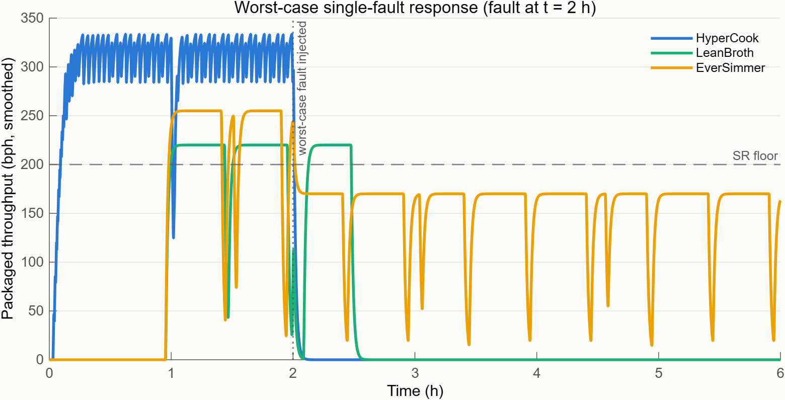

# Intergalactic Vegan Soup Factory

A space-based vegan soup production facility, modeled end-to-end using a full **RFLP** (Requirements–Functional–Logical–Physical) architecture in MathWorks System Composer.

The facility receives ingredient deliveries by rocket, stores and prepares them, cooks soup at scale, performs quality assurance, packages the result for interstellar transit, and dispatches it to customers across the galaxy — all under tight mass, power, cost, and volume budgets, across a wide range of ambient gravity conditions, with a five-being crew.

## Toolchain

| Tool | Version |
|---|---|
| MATLAB | R2026a |
| System Composer | R2026a |
| Requirements Toolbox | R2026a |
| Simulink | R2026a |
| Stateflow | R2026a |
| Simscape | R2026a |
| Simulink Test | R2026a |

## Folder structure

| Folder | Contents |
|---|---|
| `architecture/` | System Composer models and interface dictionaries for the Functional, Logical, and Physical layers; the three Physical variant models each carry their behavioral content inline (see `behavior/` below) and link a per-variant wrapper dictionary, `Physical<Variant>Data.sldd`. |
| `behavior/` | Behavioral component library (model references + subsystem references), data dictionaries, build scripts, and unit tests — instantiated inline inside the three physical architecture models rather than composed in separate plant models. See [`docs/09_behavioral_models.md`](docs/09_behavioral_models.md) / [`docs/10_behavioral_trade_update.md`](docs/10_behavioral_trade_update.md). |
| `requirements/` | Requirements Toolbox sets (`.slreqx`) imported from the source spreadsheets in `../requirements/`, plus surrogate index files (`.slmx`) maintained by Requirements Toolbox. |
| `analysis/` | Roll-up, formal compliance gate, and trade-study analysis scripts and outputs (`variantMetrics.csv`, `complianceGate.csv`, `tradeScores.csv`, `mcWinShare.csv`). Run the whole chain with `runFullAnalysis`; prove the results with `tests/runAllTests` — `runFullAnalysis` regenerates them, `runAllTests` verifies them. See [`docs/06_trade_study_results.md`](docs/06_trade_study_results.md), [`docs/08_formal_compliance_gate.md`](docs/08_formal_compliance_gate.md), and [`docs/11_test_organization.md`](docs/11_test_organization.md). |
| `tests/` | System/analysis/traceability test tiers and the suite runner; run everything with `tests/runAllTests`. See [`docs/11_test_organization.md`](docs/11_test_organization.md). |
| `docs/` | This project's systems-engineering documentation set — requirements analysis, architecture rationale, and decision log. |
| `work/` | MATLAB project build cache (`slprj/` etc.) and the derived, gitignored `work/coverage` test coverage report. Not source-controlled content; safe to delete/regenerate. |

## Model inventory

| Model | Layer | Description |
|---|---|---|
| `architecture/GalacticSoupFunctional.slx` | Functional | 12 verb-phrase functions describing *what* the system does, independent of implementation. Uses the abstract interface dictionary `FunctionalInterfaces.sldd`. |
| `architecture/GalacticSoupLogical.slx` | Logical | 12 solution-role components describing *how* the functions are organized into cooperating logical units, 1:1 with the functional layer. Uses the typed interface dictionary `LogicalInterfaces.sldd`. |
| `architecture/PhysicalHyperCook.slx` | Physical (Variant A), architecture + inline behavior | Throughput/logistics-optimized physical realization — "HyperCook." Every production-path, controller, and support component carries an inline subsystem behavior instancing the library below; this model is the executable artifact for simulation, behavioral analysis, and MCDA. |
| `architecture/PhysicalLeanBroth.slx` | Physical (Variant B), architecture + inline behavior | Resource-budget-optimized physical realization — "LeanBroth." |
| `architecture/PhysicalEverSimmer.slx` | Physical (Variant C), architecture + inline behavior | Resilience/autonomy-optimized physical realization — "EverSimmer." |
| `architecture/Physical{HyperCook,LeanBroth,EverSimmer}Data.sldd` | Physical | Per-variant wrapper dictionaries chaining `PhysicalInterfaces.sldd` and the matching `BehParams<Variant>.sldd`, so each architecture model's inline behaviors resolve their instance parameters directly. |
| `architecture/GalacticSoupComplianceGate.slx` | Verification | Generated Requirements Table model formalizing the eight SR compliance gates; rebuilt from the requirement set by `analysis/buildComplianceGate.m`. Do not hand-edit. |
| `behavior/components/Beh{Storage,PrepUnit,CookLine,CookVat,QCStation,Packager,Supervisor,ProductionCell}.slx` | Behavioral | Eight model references forming the shared behavioral component library — one per recurring production role (storage, prep, cooking, batch cooking + Stateflow/Simscape, QC, packaging, supervision, cell composition). Instantiated inline inside the three architecture models above (`createSubsystemBehavior`) rather than composed in a standalone plant model. See [`docs/09_behavioral_models.md`](docs/09_behavioral_models.md) §1, §5. |
| `behavior/subsystems/{SubTransport,SubFaultGate}.slx` | Behavioral | Two subsystem references — transfer-rate/latency utility and health/enable fault gating. |
| `behavior/data/*.sldd` | Behavioral | Five data dictionaries: `BehaviorInterfaces` (shared types), `BehParamsCommon` (physics constants), and `BehParams{HyperCook,LeanBroth,EverSimmer}` (per-variant instance parameters, each referencing Common). |
| `requirements/StakeholderNeeds.slreqx` | Requirements | 15 stakeholder needs (SN-GS-001..015), imported from `../requirements/StakeholderNeeds.xlsx`. |
| `requirements/SystemRequirements.slreqx` | Requirements | 28 system requirements (SR-GS-001..028), imported from `../requirements/SystemRequirements.xlsx`, Derive-linked to stakeholder needs. |

## How the RFLP layers relate

1. **Requirements** — Stakeholder Needs (SN-GS-*) capture what the customer and mission need in plain terms. System Requirements (SR-GS-*) refine those needs into verifiable, quantified engineering requirements via Derive links. See [`docs/01_requirements_analysis.md`](docs/01_requirements_analysis.md).
2. **Functional architecture** — decomposes the system into 12 verb-phrase functions connected by an abstract material/control/status flow, each function tracing to the SRs it satisfies. See [`docs/02_functional_architecture.md`](docs/02_functional_architecture.md).
3. **Logical architecture** — assigns each function to a solution-role logical component with typed interfaces, still implementation-agnostic (no specific hardware or vendor choices yet). See [`docs/03_logical_architecture.md`](docs/03_logical_architecture.md).
4. **Physical architecture** — three competing physical variants (HyperCook, LeanBroth, EverSimmer) realize the logical components as concrete hardware, each with a distinct design philosophy and stereotype-based quantitative properties (mass, power, cost, volume, throughput, automation, MTBF, gravity rating). See [`docs/04_physical_variants.md`](docs/04_physical_variants.md).
5. **Trade study** — a roll-up analysis and multi-criteria decision analysis (MCDA) across the three physical variants selects the preferred architecture. See [`docs/05_trade_study_methodology.md`](docs/05_trade_study_methodology.md) for method and [`docs/06_trade_study_results.md`](docs/06_trade_study_results.md) for full results.
6. **Behavioral layer** — a reusable Simulink/Stateflow/Simscape component library gives the physical variants executable dynamics (rate-limited flow, batch sequencing, thermal physics, supervisory fault response), instantiated directly inside the physical architecture models as inline subsystem behaviors (`createSubsystemBehavior`, ADR-020) rather than composed in separate plant models. The mechanism preserves each component's architecture ports, connectors, and stereotype property values, so simulation, behavioral analysis, and MCDA all run on the same three System Composer models that carry the requirements allocation and roll-up. Simulated throughput and fault-response metrics feed back into the roll-up and trade study. See [`docs/09_behavioral_models.md`](docs/09_behavioral_models.md) and [`docs/10_behavioral_trade_update.md`](docs/10_behavioral_trade_update.md).

Design decisions and their rationale are recorded in [`docs/07_decision_log.md`](docs/07_decision_log.md).

## Documentation index

| Doc | Contents |
|---|---|
| [`docs/01_requirements_analysis.md`](docs/01_requirements_analysis.md) | Stakeholder needs & system requirements tables, traceability, driving requirements. |
| [`docs/02_functional_architecture.md`](docs/02_functional_architecture.md) | Functional decomposition, function-to-SR trace, interface definitions, flow description. |
| [`docs/03_logical_architecture.md`](docs/03_logical_architecture.md) | Logical components, functional→logical realization, typed interface definitions. |
| [`docs/04_physical_variants.md`](docs/04_physical_variants.md) | HyperCook / LeanBroth / EverSimmer variant concepts and expected trade-offs. |
| [`docs/05_trade_study_methodology.md`](docs/05_trade_study_methodology.md) | Roll-up metric definitions, budget cap parsing, MCDA normalization/weighting/Monte Carlo method, threats to validity. |
| [`docs/06_trade_study_results.md`](docs/06_trade_study_results.md) | Full trade study results: metrics, compliance gates, criteria/scenario scores, Monte Carlo win share, per-variant findings, caveats, recommendation. |
| [`docs/07_decision_log.md`](docs/07_decision_log.md) | ADR-style architectural decision log. |
| [`docs/08_formal_compliance_gate.md`](docs/08_formal_compliance_gate.md) | Formal SR compliance gate built on the Requirements Table block: design, generation, status harvesting, API gotchas, assessment. |
| [`docs/09_behavioral_models.md`](docs/09_behavioral_models.md) | Behavioral component library: componentization strategy, modeling abstractions, folder/data architecture, component behaviors, verification, tool gotchas. |
| [`docs/10_behavioral_trade_update.md`](docs/10_behavioral_trade_update.md) | Trade study update with behavioral fidelity: simulated vs. static metrics, LeanBroth's SR-GS-002 failure, updated scenario/Monte Carlo results, recommendation, threats to validity. |
| [`docs/11_test_organization.md`](docs/11_test_organization.md) | Analysis verification as a tagged MATLAB Test suite: the four tiers, project-metadata suite assembly, the golden-totals catch, the requirements-linking limitation, runtime notes. |
| [`docs/explainers/README.md`](docs/explainers/README.md) | Plain-language explainer cards, one per analysis case in the chain. |

## Trade study summary

The static roll-up and seven-criterion MCDA trade study ([`docs/05_trade_study_methodology.md`](docs/05_trade_study_methodology.md), [`docs/06_trade_study_results.md`](docs/06_trade_study_results.md)) has since been updated with a behavioral layer of executable Simulink/Stateflow/Simscape models ([`docs/09_behavioral_models.md`](docs/09_behavioral_models.md)) that replaces the static throughput and single-fault-retention figures with simulated values ([`docs/10_behavioral_trade_update.md`](docs/10_behavioral_trade_update.md)). The behavioral models expose yield loss and downtime the static stage tables never captured — QC reject fractions, periodic calibration outages, batch cold-start — and every variant's simulated throughput comes in below its static value as a result.

For LeanBroth this is decisive: simulated steady throughput (196.8 bph) falls below the SR-GS-002 200 bph floor, and the formal Requirements Table gate flags exactly the Throughput row. LeanBroth is now excluded from MCDA scoring and loses its status as the documented CostLean descope option pending a QC or prep redesign. With LeanBroth excluded, **EverSimmer wins all four stakeholder weighting scenarios** (Balanced, ThroughputFirst, CostLean, and MissionAssurance) and **98.4%** of a 5,000-sample Monte Carlo random-weight sensitivity sweep against HyperCook's 1.6% — up from 3 of 4 scenarios and an 84% win share in the static analysis. EverSimmer's single-fault resilience, previously an idealized 66.7% capacity estimate, is now demonstrated dynamically: fault injection steps it down to roughly two-thirds output with the BehSupervisor chart transitioning to a Degraded mode, while HyperCook and LeanBroth both collapse to zero as single-string topologies (HyperCook's single string is now traced to `InlineQCScanner`, its worst-case fault point in the architecture model). EverSimmer's energy per bowl (1.212 kWh) lands mid-field between LeanBroth's batch efficiency (0.814 kWh) and HyperCook's continuous draw (1.554 kWh); a new finding is that both batch-plant variants take on the order of an hour to reach steady output from a cold start, versus 119 s for HyperCook, favoring HyperCook specifically for surge-restart scenarios.

**Recommendation: adopt EverSimmer as the baseline physical architecture — reinforced, not revised** (see [`docs/07_decision_log.md`](docs/07_decision_log.md) ADR-009, ADR-018). The three original follow-up actions stand (negotiate EverSimmer's thin cost margin, define a degraded-mode operations procedure for the single-cell-loss contingency, and — pending its QC/prep redesign — reconsider LeanBroth as a descope option), joined by two new ones from the behavioral update: a LeanBroth QC redesign study, and backpressure modeling to address the current gap where buffer overflow discards flow rather than conserving mass.

