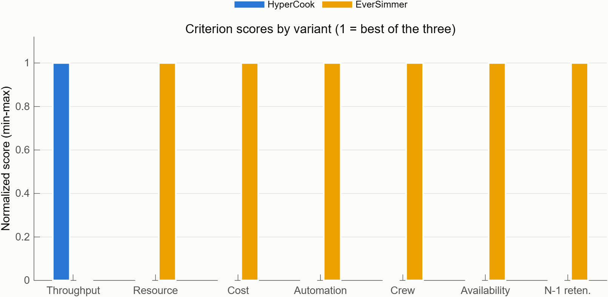

# 06 — Trade Study Results

Methodology: [`05_trade_study_methodology.md`](05_trade_study_methodology.md). Source data: [`../analysis/variantMetrics.csv`](../analysis/variantMetrics.csv), [`../analysis/tradeScores.csv`](../analysis/tradeScores.csv), [`../analysis/mcWinShare.csv`](../analysis/mcWinShare.csv), produced by [`../analysis/runVariantAnalysis.m`](../analysis/runVariantAnalysis.m) and [`../analysis/runTradeStudy.m`](../analysis/runTradeStudy.m). Variant design concepts are described in [`04_physical_variants.md`](04_physical_variants.md).

The trade study has been run. This document reports the full results and the recommendation that follows from them.

## 1. Rolled-up metrics and budget utilization

| Metric | HyperCook (A) | LeanBroth (B) | EverSimmer (C) | SR cap |
|---|---|---|---|---|
| Mass, kg (utilization) | 14,320 (95.5%) | 7,570 (50.5%) | 11,120 (74.1%) | ≤15,000 (SR-GS-011) |
| Power, kW (utilization) | 498 (99.6%) | 239 (47.8%) | 363 (72.6%) | ≤500 (SR-GS-012) |
| Cost, kCr (utilization) | 1,980 (99.0%) | 1,070 (53.5%) | 1,905 (95.3%) | ≤2,000 (SR-GS-013) |
| Volume, m³ (utilization) | 397 (99.3%) | 240 (60.0%) | 297 (74.3%) | ≤400 (SR-GS-014) |
| Throughput, bph (margin) | 320 (+60%) | 210 (+5%) | 240 (+20%) | ≥200 (SR-GS-002) |
| Automation, avg | 0.944 | 0.800 (zero margin) | 0.956 | ≥0.8 (SR-GS-003) |
| Operators | 3.8 | 4.9 | 2.7 | ≤5 (SR-GS-004) |
| Availability | 0.9591 | 0.9720 | 0.9789 | — (informative) |
| N-1 capacity retention | 0% | 0% | 66.7% (160 bph after losing one cell) | — (informative) |
| Leaf component count | 19 | 16 | 25 (3 nested `ProductionCell`s x 5 units + 10 top-level) | — |

Every variant runs at or above 95% utilization on at least one budget (HyperCook on mass/power/cost/volume simultaneously; EverSimmer on cost). LeanBroth is the only variant with comfortable margin (47.8-60.0%) across all four resource budgets.

## 2. Compliance gates

All eight SR gates pass for all three variants — every variant is a compliant candidate baseline; the trade study exists to rank compliant designs, not to eliminate non-compliant ones.

| Gate | SR | HyperCook | LeanBroth | EverSimmer |
|---|---|---|---|---|
| Mass ≤ 15,000 kg | SR-GS-011 | PASS | PASS | PASS |
| Power ≤ 500 kW | SR-GS-012 | PASS | PASS | PASS |
| Cost ≤ 2,000 kCr | SR-GS-013 | PASS | PASS | PASS |
| Volume ≤ 400 m³ | SR-GS-014 | PASS | PASS | PASS |
| Throughput ≥ 200 bph | SR-GS-002 | PASS | PASS | PASS |
| Automation ≥ 0.8 | SR-GS-003 | PASS | PASS | PASS |
| Operators ≤ 5 | SR-GS-004 | PASS | PASS | PASS |
| Gravity ≥ 12 g | SR-GS-015/016 | PASS | PASS | PASS |
| **All 8 gates** | | **PASS** | **PASS** | **PASS** |

## 3. Criteria scores

Min-max normalized scores (see [`05_trade_study_methodology.md`](05_trade_study_methodology.md) §3) show a consistent pattern: EverSimmer leads on Automation, Availability, and N-1 Retention (it is the only variant with any single-fault throughput retention at all — the other two both retain 0% after their worst-case single-unit loss); LeanBroth leads on ResourceMargin and CostMargin by a wide margin; HyperCook leads only on ThroughputMargin, and even there its lead over EverSimmer is modest (+60% vs. +20% margin) given EverSimmer's parallel-cell topology also produces real throughput headroom.

## 4. Scenario scores

| Scenario | HyperCook (A) | LeanBroth (B) | EverSimmer (C) | Winner |
|---|---|---|---|---|
| Balanced | 0.342 | 0.347 | 0.671 | EverSimmer |
| ThroughputFirst | 0.467 | 0.297 | 0.585 | EverSimmer |
| CostLean | 0.196 | 0.615 | 0.514 | LeanBroth |
| MissionAssurance | 0.242 | 0.312 | 0.812 | EverSimmer |

EverSimmer wins three of the four named scenarios, including **ThroughputFirst** — a scenario weighted 35% toward raw throughput margin, where HyperCook was expected to dominate. HyperCook's razor-thin margins on every *other* criterion (cost, resources, automation headroom, N-1 retention) drag its weighted score down even under throughput-weighted scoring, so its throughput edge alone is not enough to win. LeanBroth wins only under **CostLean**, the one scenario that weights cost and resource margin most heavily (0.55 combined) — consistent with it being purpose-built as the resource-budget-optimized variant.

## 5. Monte Carlo weight sensitivity

Across 5,000 random Dirichlet weight draws (`rng(42)`, see methodology §3), the win shares are:

| Variant | Win share |
|---|---|
| HyperCook (A) | 5.0% |
| LeanBroth (B) | 11.0% |
| EverSimmer (C) | 84.0% |

EverSimmer wins 84% of random weightings spanning the full space of plausible stakeholder priorities — not just the four hand-picked scenarios above — indicating the result is not an artifact of scenario selection.

## 6. Per-variant findings

**HyperCook (A).** Delivers the highest raw throughput (320 bph, +60% margin) but at the cost of running within 0.4-1.0% of the mass, power, cost, and volume caps simultaneously — the least margin of any variant on four of five budget dimensions at once. Its single-string cook/prep/transport topology also gives it 0% N-1 throughput retention, matching LeanBroth's worst case despite HyperCook being the "high-automation, high-throughput" design. It loses even the ThroughputFirst scenario to EverSimmer because near-zero margin everywhere else swamps its throughput lead once any other criterion is weighted at all.

**LeanBroth (B).** The clear resource-budget leader — comfortably under every mass/power/cost/volume cap (47.8-60.0% utilization) and lowest absolute cost (1,070 kCr). It meets, but does not comfortably clear, its other targets: throughput margin is only +5% (210 vs. 200 bph floor) and automation is exactly at the 0.8 floor with zero margin. It wins the CostLean scenario and takes a real (11%) share of the Monte Carlo draws, confirming it is the right choice specifically when budget headroom is prioritized over throughput or resilience.

**EverSimmer (C).** Wins 3 of 4 named scenarios and 84% of random weightings — the most robust performer across the plausible range of stakeholder priorities. Its triplicated-cell topology is the only one of the three with any graceful degradation at all (66.7% retention, 160 bph after losing one cell), and it leads on automation (0.956) and availability (0.9789) as well. Its principal weakness is cost: at 1,905 kCr it is 95.3% of the cost cap, second only to HyperCook, with just a 4.7% cost margin — the resilience and autonomy gains are not free.

## 7. Caveats

1. **EverSimmer's cost margin is only 4.7%.** At 1,905 of 2,000 kCr, EverSimmer has the least cost headroom of any compliant variant apart from HyperCook. Any further requirement growth, vendor cost increase, or triplicated-cell scope creep is a real risk of pushing it over the SR-GS-013 cost cap.
2. **EverSimmer's degraded-mode throughput (160 bph) is below the SR-GS-002 nominal floor (200 bph).** The 66.7% N-1 retention figure satisfies the *intent* of SR-GS-026 (no uncontrolled production halt from a single fault) as a graceful-degradation contingency mode, but 160 bph is not a compliant steady-state operating point against SR-GS-002. Degraded operation following a cell loss must be treated and documented as a contingency mode, not an alternate compliant nominal state.
3. **LeanBroth passes automation (SR-GS-003) with exactly zero margin.** At 0.800 average automation against a 0.8 floor, any single component substitution, added manual step, or measurement rounding could tip LeanBroth into non-compliance. This is the tightest gate margin observed across all three variants on any SR.
4. **HyperCook is one requirement-growth event away from multiple simultaneous violations.** Its power (0.4% margin), cost (1.0% margin), and volume (0.7% margin) margins are all under 1%. A single component overrun in any of these dimensions — not unusual during detailed design — would likely cascade into cap violations across more than one budget at once, since HyperCook has essentially no slack to absorb it in any of the three.

## 8. Recommendation

**Adopt EverSimmer (Variant C) as the baseline physical architecture.**

EverSimmer wins 3 of 4 stakeholder weighting scenarios (Balanced 0.671, ThroughputFirst 0.585, MissionAssurance 0.812 — all highest of the three) and 84% of 5,000 Monte Carlo random weightings, the most robust result of any variant across the plausible range of stakeholder priorities. It is the only variant offering any graceful degradation under single-fault conditions (66.7% N-1 retention vs. 0% for both HyperCook and LeanBroth), leads on automation and availability, and clears all eight SR compliance gates.

This recommendation carries three follow-up actions to address the caveats above:

1. **Negotiate a cost reserve or descope items** to widen EverSimmer's 4.7% cost margin before detailed design locks in triplicated-cell vendor costs, since it is currently the second-tightest cost margin of the three variants.
2. **Define a degraded-mode operations procedure** for the 160 bph single-cell-loss contingency, documenting it explicitly as a below-nominal contingency state (not a compliant steady-state alternative to the 200 bph SR-GS-002 floor) with clear criteria for when to invoke it and how operations and customer commitments adjust while in it.
3. **Carry LeanBroth as a documented descope option.** If budget priorities shift and mass/power/cost/volume margin becomes the dominant driver, LeanBroth's CostLean-scenario win (0.615) and 11% Monte Carlo win share make it the next-best alternative to re-evaluate, given it comfortably clears every resource budget where EverSimmer and HyperCook do not.
