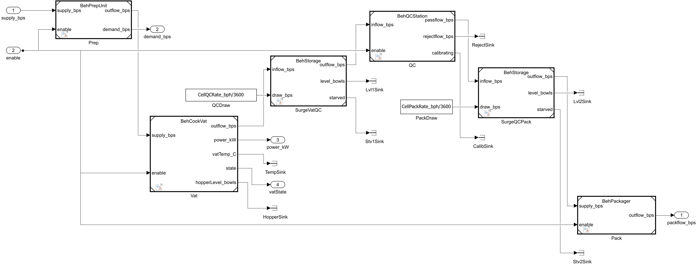
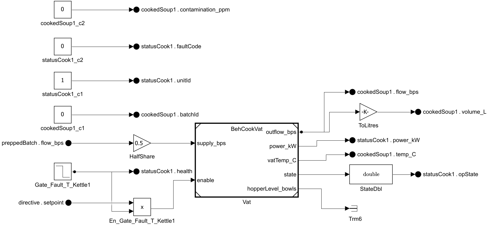

# 09 — Behavioral Models for the Physical Variants

Branch exploration: raising the fidelity of the architecture trade study by giving the physical variants executable behavior — Simulink dynamics, Stateflow supervisory/batch logic, and Simscape thermal physics — organized as a reusable, unit-testable component library that is instantiated directly inside the System Composer physical architecture models as inline subsystem behaviors. Simulation, behavioral analysis, and MCDA all run on the three architecture models themselves — there is no separate plant-model layer.

Artifacts: [`../behavior/`](../behavior/) (component models, subsystem references, data dictionaries, build scripts, tests) and [`../architecture/`](../architecture/) (the three physical variant models, each now carrying inline behavior, plus their per-variant wrapper dictionaries). Decisions: ADR-012 through ADR-020 in [`07_decision_log.md`](07_decision_log.md). Trade-study impact: [`10_behavioral_trade_update.md`](10_behavioral_trade_update.md).

## 1. Componentization strategy

The architectural components are the componentization guide. Every physical variant is built from the same recurring production roles — storage, prep, cooking, QC, packaging, transport, supervision — realized at different scales and multiplicities. The behavioral layer therefore is a **shared component library** (one referenced model per role), parameterized per variant and per instance, rather than three monolithic variant models:

| Behavioral component | Kind | Realizes (architecture) | Behavior content |
|---|---|---|---|
| `BehStorage` | Model reference | IngredientStorageUnit concepts (ColdStorageVault, ColdStoreLocker, DualZoneStore, hoppers) | Bounded buffer integrator: level, starvation, overflow |
| `BehPrepUnit` | Model reference | RoboticPrepLine, PrepWorkstation, CellPrepUnit | Rate-limited processing with startup lag |
| `BehCookLine` | Model reference | ContinuousCookLine1..4 (HyperCook) | Continuous rate-limited cooking, load-dependent power draw |
| `BehCookVat` | Model reference | BatchKettle1/2 (LeanBroth), CellCookVat (EverSimmer) | **Stateflow** batch sequencer (Idle→Fill→Heat→Simmer→Drain→Clean) driving a **Simscape** thermal network (heater source, thermal mass, convective loss); throughput *emerges* from the batch cycle |
| `BehQCStation` | Model reference | InlineQCScanner, QCBench, CellQCSensor | **Stateflow** inspection modes incl. periodic calibration downtime; reject-fraction yield loss |
| `BehPackager` | Model reference | HighSpeedPackagingLine, SemiAutoPackager, CellPackager | Rate-limited packaging with backlog |
| `BehSupervisor` | Model reference | ProductionControlSystem concepts (CentralControlComputer, OpsConsole, ControlTriad) | **Stateflow** plant modes (Startup/Nominal/Degraded/Halted), per-line enable/disable on health loss |
| `BehProductionCell` | Model reference (composite) | ProductionCell1..3 (EverSimmer) | Composes BehPrepUnit→BehCookVat→BehQCStation→BehPackager, mirroring the architecture's cell decomposition |
| `SubTransport` | **Subsystem reference** (masked) | ConveyorNetwork, AGVCartPool, RoboTransportSwarm | Transfer-rate saturation + transport latency |
| `SubFaultGate` | **Subsystem reference** | (cross-cutting) | Health/enable gating of a flow |
| `PhysicalHyperCook` / `PhysicalLeanBroth` / `PhysicalEverSimmer` | System Composer architecture model, executable top model | The three physical variants | Every production-path, controller, and support component carries an inline subsystem behavior (`createSubsystemBehavior`) instancing the components above in Normal mode; the architecture model is the simulated artifact — see §5 |

Model references were chosen for the stateful production roles (independent simulation and unit testing, per-instance parameterization via model arguments, incremental build); subsystem references for the small stateless/utility pieces where a separate model interface would be ceremony (ADR-013). The three former top models, `BehPlantHyperCook`/`BehPlantLeanBroth`/`BehPlantEverSimmer`, are retired (ADR-020): the component library is now instantiated inline in the architecture models rather than composed in standalone plant models.

## 2. Modeling abstractions

- **Continuous-flow abstraction.** Material moves as continuous rate signals in bowls/second (bowl-equivalents for pre-cook material). SimEvents (discrete entities) was considered and rejected: entity queues would add fidelity where the trade study doesn't need it, complicate Simscape/Stateflow integration, and the architecture-level metrics are rates anyway (ADR-014). Batchiness — the fidelity that matters, because it drives cycle-time throughput and thermal energy — is captured by the BehCookVat sequencer, not by discretizing the flow.
- **Time base is seconds** (Simscape's native time), rates are bowls/sec internally; parameters and reported metrics use bowls/hour (bph) with explicit 1/3600 conversions at the boundaries.
- **Thermal fidelity where it pays.** Only the batch vat gets physical modeling (heat-up time and simmer energy are what differentiate batch from continuous cooking). Power for everything else is load-scaled or static draw from the stereotype values. Simscape Electrical power-network modeling was considered and rejected as fidelity without a consumer (ADR-015).
- **Lumped thermal mass.** The vat + charge is one thermal mass sized for a full batch; mass variation during fill/drain is ignored (conservative for heat-up time).

## 3. Folder and data architecture

```
behavior/
  components/   BehStorage BehPrepUnit BehCookLine BehCookVat BehQCStation
                BehPackager BehSupervisor BehProductionCell        (.slx model references)
  subsystems/   SubTransport SubFaultGate                          (.slx subsystem references)
  data/         BehaviorInterfaces.sldd   shared types (PlantMode enum, VatState enum)
                BehParamsCommon.sldd      soup/thermal physics constants
                BehParamsHyperCook.sldd   variant instance parameters   (references Common)
                BehParamsLeanBroth.sldd   variant instance parameters   (references Common)
                BehParamsEverSimmer.sldd   variant instance parameters   (references Common)
  build/        setupBehaviorData.m, buildInlineBehaviors.m (idempotent, per-variant
                inline-behavior population), and other model build/rebuild scripts
  tests/        matlab.unittest classes, one per component (7 classes, 21 test methods)
```

The `plants/` folder (`BehPlantHyperCook`/`BehPlantLeanBroth`/`BehPlantEverSimmer`) is gone — retired along with `BehKettleBehavior.slx` and `behavior/build/buildKettleAdapters.m` (ADR-020). The component library now lives inside `architecture/physical/PhysicalHyperCook.slx`/`PhysicalLeanBroth.slx`/`PhysicalEverSimmer.slx` as inline subsystem behaviors (§5). Each of those three architecture models links a wrapper dictionary, `architecture/Physical<Variant>Data.sldd`, chaining `PhysicalInterfaces.sldd` and the variant's `BehParams<Variant>.sldd` so component instance parameters resolve directly inside the architecture model.

Parameterization contract (ADR-016): component models declare **model arguments** (instance parameters) with neutral defaults in their model workspaces; the architecture models link their variant wrapper dictionary and bind each model-reference instance's arguments to named dictionary entries (`HC_*`, `LB_*`, `ES_*`). Component models link only `BehaviorInterfaces.sldd` + `BehParamsCommon.sldd` — they carry no variant knowledge, which is what keeps them reusable and independently testable.

## 4. Component behaviors

*(interface/behavior detail per component — see the build scripts and tests as the executable definition)*

- **BehCookVat cycle**: Idle → Fill (hopper→vat at fill rate) → Heat (heater on until simmer temperature) → Simmer (bang-bang hold for simmer time) → Drain (batch out at drain rate) → Clean → Idle. Heater power, thermal mass, and convective loss set the heat-up segment physically; batch size / total cycle time reproduces the stereotype throughput at nominal parameters and *degrades it* when starved upstream.
- **BehQCStation**: throughput-limited inspection with a periodic calibration outage (Inspecting ⇄ Calibrating) and a reject fraction diverted off the good path — the first yield-loss mechanism in the project (the static roll-up assumed lossless flow).
- **BehSupervisor**: Startup until output established → Nominal; any line-health drop → Degraded with failed lines disabled; all lines lost → Halted. Mode and per-line enables are plant outputs, so degraded-capacity behavior is observable and testable.


*BehCookVat: Stateflow batch sequencer driving the Simscape thermal network.*


*The Idle→Fill→Heat→Simmer→Drain→Clean sequencer, expanded.*


*BehProductionCell: BehPrepUnit→BehCookVat→BehQCStation→BehPackager, one EverSimmer cell.*

## 5. Inline behavior integration with the architecture models

The behavioral component library connects to the System Composer physical architecture through `createSubsystemBehavior(comp)`, which converts an architecture component into an inline Simulink subsystem behavior. Unlike `linkToModel` (§8), the conversion **preserves** the component's existing architecture ports, connectors, and stereotype property values — `isReference` stays 0, so roll-up analysis keeps working against the same component without special-casing. The interior of each converted component holds bus-element port readers/writers, thin unit/type glue, and a Normal-mode model reference to the appropriate `Beh*` component.

All ~50 components across the three physical models now carry behavior:

- **Production-path components** wrap the matching library component directly: `BehStorage`, `BehPrepUnit`, `BehCookLine`, `BehCookVat`, `BehQCStation`, `BehPackager`.
- **Controllers** — `CentralControlComputer`/`OpsConsole`/`ControlTriad` and the three `CellController`s — host `BehSupervisor` and aggregate telemetry from the status buses they already receive.
- **Support components** (reactors, gravity compensation, refuel, inventory, transport) are status stubs, present so that every bus a downstream component consumes resolves to something, even where the component itself has no interesting dynamics.

**Interface extensions.** The interfaces gained additive elements to carry the new signals: `flow_bps` on `IngredientPallet`/`PreparedBatch`/`SoupStream`/`SealedContainerBatch`; `power_kW` and `health` on `StatusBus`; and a new `TelemetryBus` (`totalPower_kW`, `plantMode`) routed from each controller to a new root `Telemetry` port. Because every component's status now reports power, total plant power is aggregated architecturally — each controller sums it from the status buses it already receives, rather than being computed by an external analysis script.

**Wrapper dictionaries.** Each architecture model links a per-variant wrapper dictionary, `architecture/Physical<Variant>Data.sldd`, chaining `PhysicalInterfaces.sldd` and the variant's `BehParams<Variant>.sldd` so the inline behaviors' instance parameters resolve without the architecture model needing to know about the behavioral dictionary chain directly.

**Fault gates.** Every faultable component self-gates with a `Step` block driven by a model-workspace variable `Fault_T_<Comp>` (default `1e9`, i.e. never), overridden per run via `setVariable` to inject a fault at a specific simulated time — this is what `runBehavioralAnalysis.m` uses to produce the worst-case single-fault metric (§6).

**Routing is fixed, not reallocated.** Fan-outs use fixed shares (0.5, 1/3) matching the physical routing topology; the supervisor's degraded-mode response disables failed lines but does not dynamically reallocate flow shares among survivors — that would be a supervisory capability the architecture does not model.

**Resupply and shipment boundaries.** Resupply flow is generated inside the launch-pad component from the variant's wrapper dictionary; packaged output is read at the root `OutboundShipments.flow_bps` outport.

The build script `behavior/build/buildInlineBehaviors.m` performs this population; it is idempotent and runs per-variant, so it can be re-run against a model that already has some or all of its components converted.


*BatchKettle1's inline behavior interior (LeanBroth): fault gate, half-share routing, the `BehCookVat` model reference, and bus glue — the pattern repeated, with variant-appropriate glue, across all ~50 behavior-bearing components.*

## 6. Simulated metrics feeding the trade study

Per variant, `runBehavioralAnalysis.m` now simulates `PhysicalHyperCook`/`PhysicalLeanBroth`/`PhysicalEverSimmer` directly — the architecture models are the executable artifact; there is no separate plant model to simulate. It reports steady-state packaged throughput (bph, nominal), time-to-first-output (s), energy per bowl (kWh, integrated actual power including physical heater duty), and worst-case single-fault retained throughput (fault injected mid-run via the component's `Fault_T_<Comp>` gate, §5, at the variant's weakest architecture component). Because the architecture has no explicit conveyor material edge, HyperCook's worst-case fault point is `InlineQCScanner` rather than the conveyor — QC and packaging are its single strings; LeanBroth's is `PrepWorkstation`; EverSimmer's is `ProductionCell1`, gated as a whole cell. See [`10_behavioral_trade_update.md`](10_behavioral_trade_update.md) for how these replace the static stage-table values in the roll-up, gate, and MCDA, and for the results.

## 7. Verification

Every behavioral component has a corresponding `matlab.unittest` class in [`../behavior/tests/`](../behavior/tests/) (`tBehStorage`, `tBehPrepUnit`, `tBehCookLine`, `tBehCookVat`, `tBehQCStation`, `tBehPackager`, `tBehSupervisor` — one class per component), run via `runBehTests` or plain `runtests` against the folder. All 21 test methods pass. Each test simulates the component's referenced model directly — not through a plant — by building a `Simulink.SimulationInput`, driving it with an `ExternalInput` matrix (time-and-value breakpoints, see §8), and checking the logged outputs against expected steady-state or transient behavior.

The tests earned their keep as a cross-check on the models, not just on themselves. `tBehSupervisor` caught a real supervisor bug: a per-line enable vector sized for the wrong number of lines, which passed compilation (Simulink does not statically catch a mismatched-but-plausible vector width against a downstream mux) and only surfaced as a dimension mismatch once the test drove all lines through a fault transition. Two additional traps turned out to be on the *test* side rather than the model side, and cost real debugging time before being understood as API behavior rather than model defects — both are recorded in §8: `setVariable` silently failing to reach model-workspace arguments, and `ExternalInput` linear interpolation smearing step stimuli across a timestep instead of producing a clean edge.

## 8. Tool usage decisions and gotchas (R2026a)

Discovered empirically while building the behavioral layer and its tests; recorded here in the same spirit as [`08_formal_compliance_gate.md`](08_formal_compliance_gate.md) §5 — most are not obvious from the documentation.

- **`setVariable` on a `SimulationInput` does not reach model-workspace variables** (model arguments) unless called as `setVariable(in, name, value, 'Workspace', modelName)`. Without the `'Workspace'` name-value pair it silently no-ops — the simulation runs with the model's default argument value and gives no error, which makes this trap easy to miss in a test that only checks pass/fail on a tolerance.
- **Simscape compile-time parameters cannot reference model arguments in a referenced model.** The Thermal Mass block's `mass` parameter, left at its default *compile-time* value configuration, errors (or silently freezes a stale per-instance value) when its expression is a model argument. Fix: set the parameter's value configuration to run-time (`mass_conf` = `'runtime'`).
- **Simscape logging is unsupported under model reference.** Set `SimscapeLogType='none'` in the referenced model rather than trying to log Simscape signals through a model-reference boundary.
- **Accelerated model-reference targets inline "non-tunable expressions."** Transfer-function denominators like `[Tau_s 1]` and even Constant-block expressions like `Rate_bph/3600` that reference model arguments either error under Accelerator mode or silently freeze at whatever value happened to be resolved for the first instance, ignoring per-instance overrides for every subsequent instance. Decision: all model references run in **Normal** simulation mode (ADR-015) — the accelerator speedup is not worth the silent per-instance-parameter corruption risk.
- **Stateflow chart Parameter data resolves through the model workspace and the linked dictionary chain.** Declaring dictionary constants (the `PLANT_*`/`VAT_*` mode codes, `SimmerTemp_C`) as chart Parameter data is enough — they bind by name with no extra wiring.
- **Stateflow vector data:** `Props.Array.Size = '4'` fails to compile against `ones(1,4)` assignments in chart code — use `'[1 4]'` (row-vector shape, not element count). This property is also only settable via the Stateflow API object (`d.Props.Array.Size = ...`), not via a dotted `set_param` path.
- **Model references have conservative direct-feedthrough at their boundaries.** Supervisor feedback (plant output → supervisor → line enables → plant) and demand feedback (prep demand → storage draw → storage outflow → prep) both close into algebraic loops across model-reference boundaries. Each loop is broken with a 1 s `UnitDelay` — justified as a "telemetry delay," which is physically defensible for a supervisory control path anyway.
- **A batch drain burst silently discards flow at a downstream `min()`.** BehCookVat's Drain phase empties a full batch in a short burst (~0.27 bowls/s) into a rate-limited continuous stage; without a buffer, the excess above the downstream rate limit is dropped rather than queued. Every batch-to-continuous transition needs a surge buffer — we reuse `BehStorage` instances as inter-stage surge tanks, which is the componentization (§1) paying for itself a second time.
- **`model_edit` changes live only in memory.** An unsaved model closed by `bdclose('all')` silently reverts to its last-saved state. This bit us once — a de-looping `UnitDelay` vanished from a saved-looking model — and was only caught because the algebraic-loop warning came back on the next compile.
- **`ExternalInput` matrices are linearly interpolated between breakpoints.** A step stimulus needs a duplicated time breakpoint (e.g. `[...; 100 1; 100.001 0; ...]`); a single breakpoint per level turns the intended step into a ramp, and any threshold the step is meant to cross gets crossed mid-ramp instead of at the intended instant.
- **Root outport Dataset elements are not reliably retrievable by name.** Index `out.yout{k}` in outport port order instead of by signal name.
- **`new_system(name,'SubSystem')` creates a subsystem-reference file**, and the block parameter that points a subsystem block at it is `'ReferencedSubsystem'` — not `ReferenceFile` (that name is for model references).
- **System Composer:** `linkToModel` **replaces** a component's architecture ports with the Simulink model's root ports unless the names already match. `createSubsystemBehavior` takes no filename argument in R2026a, and its inline behavior refuses algorithm blocks (e.g. `Gain`). The working pattern (ADR-017) is an adapter behavior model whose root bus-element ports match the component's port names/interfaces, then `linkToModel` preserves everything. For multiple elements landing on one root bus port: copy the existing port block (a fresh Out Bus Element cannot join an already-named port), and the emitted element order must match the interface bus object's element order or downstream Signal Specification blocks error.
- **Correction: the claim above that `createSubsystemBehavior`'s inline behavior refuses algorithm blocks was wrong.** That conclusion (and ADR-017's record of it) came from a session where a `bdclose('all')` discarded an in-memory `createSubsystemBehavior` conversion before the population script that added the algorithm blocks ever ran — the unsaved-edit-revert gotcha above. What got inspected afterward was the reverted, pre-population interior, not a real restriction. `createSubsystemBehavior` interiors accept ordinary Simulink content — bus-element readers/writers, algorithm blocks, Normal-mode model references — with no block-kind restriction; the ~50-component inline population described in §5 (ADR-020) populates them without incident. Unlike `linkToModel`, `createSubsystemBehavior` also does not convert the component into a reference component (`isReference` stays 0), so it does not suffer the stereotype-property roll-up loss described in the next bullet.
- **`linkToModel` silently drops stereotype property values from roll-up analyses.** Linking a component to a behavior model converts it into a *reference component*, and a reference component's stereotype property values (e.g. `PhysicalProperties` `Mass_kg`, `Power_kW`, `AutomationLevel`) are excluded from instantiate/roll-up traversal even though the stereotype is still visibly applied in the Property Inspector — this cost `PhysicalLeanBroth` 90 kW, 1,400 kg, and both kettles' automation contribution the first time it was tried (ADR-017). Worse, `applyStereotype` on the now-linked component then fails outright with "profile not imported into `<behavior model>`," because the stereotype's profile isn't imported into the target Simulink model — and there is no programmatic profile-import path for a plain Simulink model in R2026a (the Profile Editor UI can import a profile interactively; `set_param(block, 'Profile', ...)` is the MATLAB code profiler and has nothing to do with System Composer profiles). If any analysis rolls up stereotype values across a model that uses `linkToModel`, re-verify those values after linking — don't assume the stereotype survives the conversion to a reference component.
- **Inline behavior ports can look stale under introspection until the model is saved.** After `createSubsystemBehavior` converts a component and the population script wires up its bus-element port blocks, querying the interior against the in-memory model can still show the pre-population (or partially-populated) port set — the same unsaved-state trap as above, applied to port visibility rather than block survival. Save the model before trusting `model_read`/`model_check` or a fresh Simulink Editor view of a just-converted component's ports.
- **Extending an interface after bus-element port blocks already exist leaves the two out of sync.** Adding an element to a bus interface (e.g. `flow_bps` on the material buses, `power_kW`/`health` on `StatusBus`, the new `TelemetryBus`) does not retroactively add a matching In/Out Bus Element block inside any inline behavior already built against the old interface — the existing element blocks keep reading/writing the old element set, and the new element has no reader/writer until one is added by hand. Extend every interface first, then run `createSubsystemBehavior` and the population script; behaviors built before an interface extension need a second pass to add the missing element blocks.
- **A `blkOf`-style block-lookup helper becomes ambiguous once element blocks are copied.** Landing multiple elements on one root bus port means copying the existing port block rather than adding a fresh one (see the `linkToModel` bullet above), so an inline behavior can end up with several In/Out Bus Element blocks of the same type and near-identical default names. A build-script helper that resolves "the" bus element block by type or a partial-name match will silently grab the wrong copy once more than one exists. Once element copies are in play, rename each copy immediately after creation and resolve reader/writer blocks by that explicit name — not by type or heuristic.
