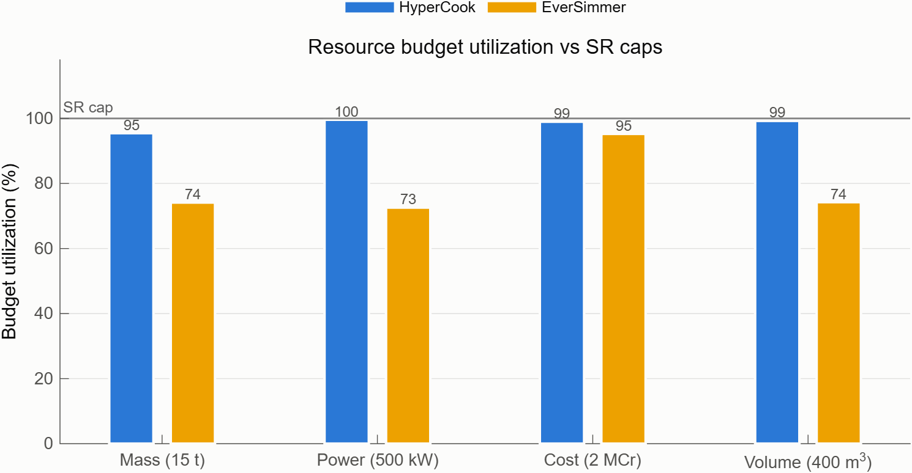

# The Paper Numbers

**The question this answers:** What does each architecture claim on its datasheet, before anything actually runs?

## How it works

- Every component in every variant — a cook line, a QC bench, a storage tank — carries the same 11 numbers: mass, power, cost, volume, throughput capacity, automation level, and a few others. Same scorecard for every part, so nothing gets left out.
- Numbers like mass, power, cost, and volume just add up. A part inside a part inside a part still adds to the total — nesting components into a group costs nothing extra in the math.
- Throughput does not add up the same way. A chain of stages only moves as fast as its slowest stage — think of a conveyor belt with one narrow spot. Parallel stages (four cook lines running side by side) do add, because losing none of them means all four contribute.
- Automation is an average across every component, not a sum — it describes how hands-off the system is, not a quantity you can pile up.
- The budget caps this analysis checks against (mass, power, cost, and so on) are read directly out of the requirement documents when the analysis runs, not typed in by hand. Change a requirement's number, and every future run picks it up automatically.

## What we found

| | HyperCook | LeanBroth | EverSimmer |
|---|---|---|---|
| Mass (kg) | 14,320 | 7,570 | 11,120 |
| Power, rated (kW) | 498 | 239 | 363 |
| Cost (kCr) | 1,980 | 1,070 | 1,905 |
| Volume (m³) | 397 | 240 | 297 |
| Throughput, rated (bph) | 320 | 210 | 240 |
| Automation | 0.944 | 0.800 | 0.956 |
| Operators | 3.8 | 4.3 | 2.7 |

## Why it matters

This pass is fast and touches every requirement, so it is the right first cut at whether a design is even in the ballpark. But it assumes soup flows through the factory with zero losses and nothing ever breaks — these are claims on a spec sheet, not evidence from a running plant. The next card puts that claim to the test.

Full detail: [05_trade_study_methodology.md](../05_trade_study_methodology.md)
