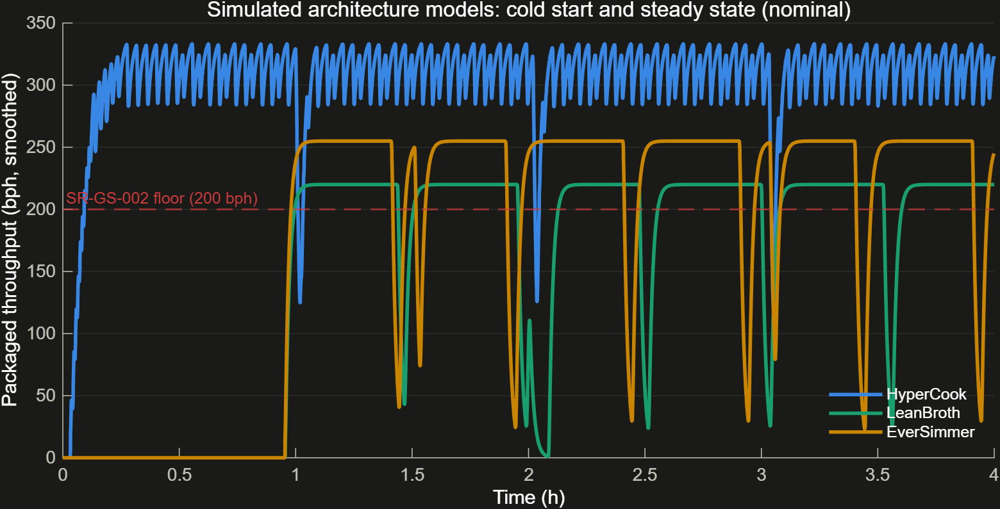

# Run the Factory

**The question this answers:** What does each architecture actually produce when the soup flows, not just what it claims on paper?

## How it works

- The architecture models are not static diagrams — they simulate. Each component has real behavior wired in: a cook line runs, a QC bench inspects, a controller reacts.
- Batch kettles (LeanBroth, EverSimmer) physically heat up before they can cook — there is a real warm-up period, the same way an oven does not hit temperature the instant you turn it on.
- QC benches reject a small percentage of bowls as defective, and they periodically pause to recalibrate — both eat into the bowls-per-hour number in a way a paper spec never shows.
- Throughput is measured at the shipping port, over the last two hours of a four-hour simulated run — long enough to get past startup and see the steady rate.
- The plant's own controller adds up power draw across every running component in real time, rather than a designer's rated-power estimate.

## What we found

| | HyperCook | LeanBroth | EverSimmer |
|---|---|---|---|
| Rated throughput (bph) | 320 | 210 | 240 |
| Simulated throughput (bph) | 308.4 | 196.8 | 231.9 |
| Change | −3.6% | −6.3% | −3.4% |
| Time to first bowl | 119 s | ~57 min | ~57 min |
| Energy per bowl (kWh) | 1.55 | 0.81 | 1.21 |
| Mean power (kW) | 479 | 160 | 281 |

## Why it matters

Every variant produces less than its datasheet promised, once real yield loss and downtime enter the picture. LeanBroth is hit hardest: its rated throughput had almost no cushion above the requirement floor, and the reject-and-recalibrate losses ate up that entire cushion. Only a simulation at this level of detail — not the roll-up in card 01 — could have caught it.

Full detail: [09_behavioral_models.md](../09_behavioral_models.md), [10_behavioral_trade_update.md](../10_behavioral_trade_update.md)
