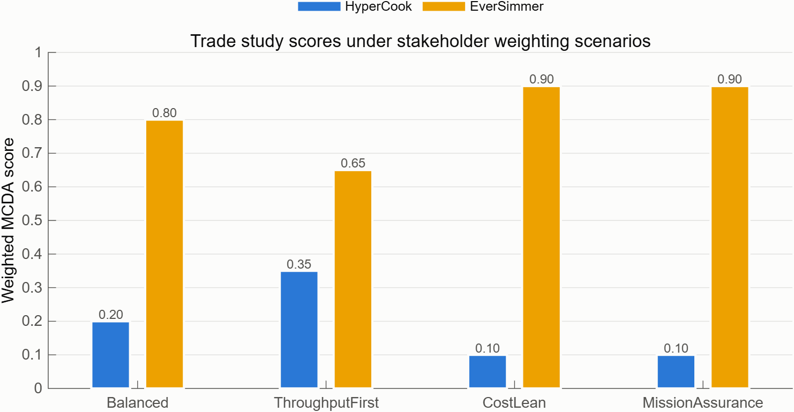

# Pick a Winner You Can Defend

**The question this answers:** Of the variants that passed the gate, which one should we actually build?

## How it works

- Seven criteria matter here — throughput headroom, resource headroom (mass/power/volume), cost headroom, automation, crew headroom, availability, and fault retention (card 03's number). Each variant is scored 0 to 1 on each one, best gets a 1, worst gets a 0.
- Four named stakeholder viewpoints are scored separately — Balanced, ThroughputFirst, CostLean, MissionAssurance — because how much a criterion matters is a matter of opinion, and different stakeholders have different opinions.
- To check whether the answer depends on picking the "right" stakeholder, the analysis also draws 5,000 random weightings and asks: who wins across nearly every plausible way of caring about these seven things? The randomness is seeded, so anyone can rerun it and get the identical 5,000 draws.
- LeanBroth is excluded from this round entirely — it did not pass the gate in card 04.

## What we found

| Scenario | EverSimmer | HyperCook |
|---|---|---|
| Balanced | 0.80 | 0.20 |
| ThroughputFirst | 0.65 | 0.35 |
| CostLean | 0.90 | 0.10 |
| MissionAssurance | 0.90 | 0.10 |

EverSimmer wins all four named scenarios, and wins **98.4%** of the 5,000 random weightings.

## Why it matters

Winning four hand-picked scenarios could just mean the committee happened to ask the right four questions. Winning 98.4% of 5,000 random ones means EverSimmer is the answer almost regardless of which stakeholder is in the room — that is the difference between "the committee liked it" and "it holds up under scrutiny."

Full detail: [05_trade_study_methodology.md](../05_trade_study_methodology.md), [06_trade_study_results.md](../06_trade_study_results.md), [10_behavioral_trade_update.md](../10_behavioral_trade_update.md)
