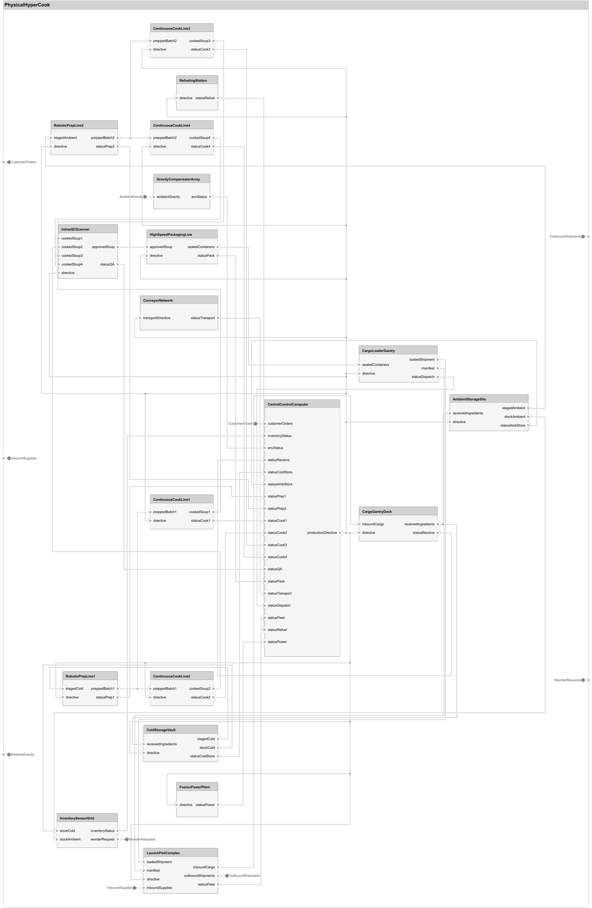
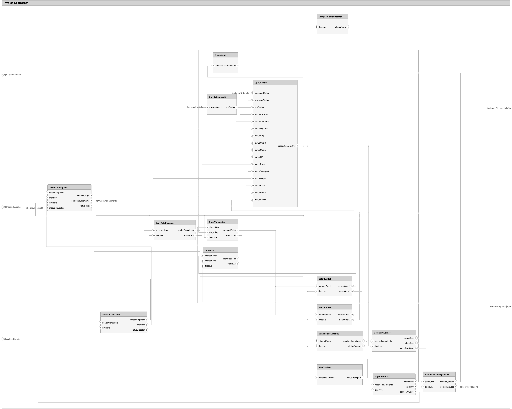
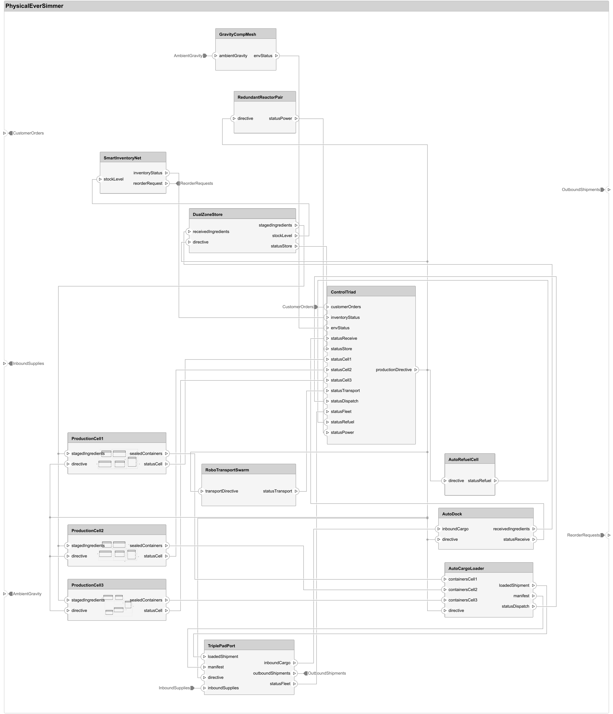
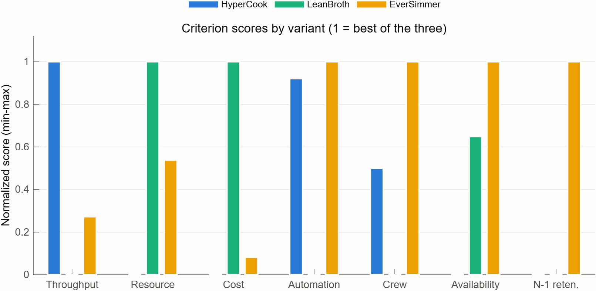
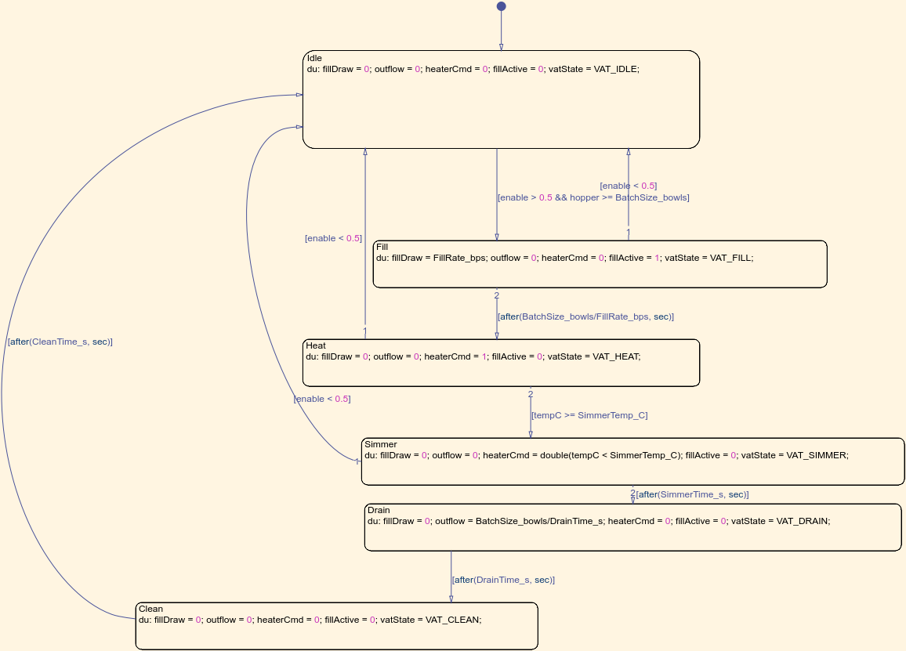

# Architecture Trade Studies with Agentic AI: Return of the Intergalactic Vegan Soup Factory

*Today's post is once again from guest blogger Sarah Dagen of MathWorks Consulting Services. Back in April, Sarah showed us how she used an AI coding agent to bootstrap a model-based systems engineering workflow. She's back, and this time the soup factory means business.*

---

In [my previous post](https://blogs.mathworks.com/simulink/2026/04/26/model-based-systems-engineering-and-agentic-ai), I used an agentic AI workflow to do some initial system design for an intergalactic vegan soup factory. That first pass produced a single architecture, and I ended the post with a question I couldn't shake: getting *an* architecture out of an agent is nice, but real systems engineering is about choosing between *alternatives*. Could the same approach handle an actual architecture trade study?

So I went back to the soup factory. This time the goal was a full RFLP (Requirements, Functional, Logical, Physical) decomposition in System Composer, three deliberately different physical architecture variants, quantitative metrics for all of them, and a defensible recommendation at the end. Everything lives in one MATLAB Project, everything traces back to the requirements, and every number in the final report is reproducible by running one function.

If you're skeptical about all of this, don't worry: you are still not alone. I've kept my honest reflections in here too, including the places where I had to overrule the agent.

## The setup

The requirements are the same as last time: 15 stakeholder needs and 28 system requirements for a facility that cooks at least 8 soup varieties at 200 bowls per hour, ships them across the galaxy by rocket, runs with at most 5 crew members, survives gravity from 0.1 g to 12 g, and fits inside hard budgets on mass (15,000 kg), power (500 kW), cost (2,000,000 credits), and volume (400 cubic meters).

The agent imported both spreadsheets into Requirements Toolbox sets and created the Derive links from needs to requirements automatically. From there we built the layers top-down:

**Functional layer.** Twelve functions with verb-phrase names (CookSoup, AssureQuality, CoordinateProduction, CompensateGravity) connected by abstract interfaces. Every system requirement traces to at least one function.

**Logical layer.** Twelve solution-role components (CookingUnit, QualityControlUnit, ProductionControlSystem) with typed interfaces. At this level of abstraction a one-to-one realization of the functions is defensible, and we recorded that reasoning in a decision log rather than pretending it was inevitable.

**Physical layer.** Here's where it gets interesting.

## Three ways to build a soup factory

A trade study needs alternatives that are actually different, not one design with three coats of paint. I asked the agent to propose variants that each optimize a different corner of the requirement space, and after some back and forth we landed on three:

**HyperCook** chases throughput. Four parallel continuous cook lines, two robotic prep lines, a four-pad launch complex, a fusion power plant. It produces 320 bowls per hour, 60% above the requirement.

**LeanBroth** chases budget margin. Two batch kettles, one semi-automated prep station, shared cranes, a compact fission reactor, and more humans in the loop. It meets every requirement while using roughly half of every budget.

**EverSimmer** chases resilience. Three fully independent production cells, each containing its own prep, cook, QC, and packaging units plus a local cell controller. A distributed control triad, redundant reactors, autonomous robotic transport. Lose any single cell and you still make soup.

The production cell is my favorite part of this architecture. It's a composite component with a complete miniature production chain inside, and System Composer's hierarchy handles it naturally:

**A design decision worth pausing on:** we modeled the variants as three separate architecture models rather than using System Composer variant components inside a single model. Variant components are great when alternatives differ at a component or two. Here the variants differ in topology, hierarchy depth, and even component count, and each one needs its own allocation set from the logical layer and its own roll-up analysis. Three models with a shared interface dictionary and a shared stereotype profile turned out to be much cleaner. That decision went into an ADR-style decision log in the repo (nineteen entries by the end of this post), which I've found is the single most useful artifact for picking the work back up weeks later.

## Making the variants measurable

Architecture pictures don't win trade studies. Numbers do. Every component in all three variants carries the same stereotype with eleven properties: mass, power, cost, volume, throughput capacity, automation level, operators required, MTBF, gravity rating, and a couple of analysis flags.

One stereotype for everything was another deliberate choice. It would have been more "correct" to give reactors a power-generation stereotype and cook lines a production stereotype, but a single uniform stereotype means one roll-up function works on every component of every variant, including EverSimmer's nested cells. The PostOrder iterator visits children before parents, so composite components accumulate their interiors automatically and arbitrary nesting depth costs nothing.

Two metrics resisted simple roll-up, and I think they're the instructive ones:

**Throughput is a bottleneck problem, not a sum.** A serial production chain runs at the speed of its slowest stage, parallel units within a stage add capacity, and an EverSimmer cell's capacity is the minimum over its own internal chain. Stereotype properties have no notion of "these four components are redundant with each other," so we encoded each variant's stage topology in a small table inside the analysis function. I flagged this in the methodology doc as the main maintenance risk: rename a component in the model and the stage table must follow by hand.

**The budget caps are parsed from the requirements at analysis time.** Instead of hard-coding 15000 in the analysis script, a helper reads SR-GS-011 from the .slreqx and extracts the number from the requirement text. If a stakeholder relaxes the mass budget next month, the analysis picks it up on the next run with zero code changes. Requirements as the single source of truth, mechanically enforced.

## Running the trade

All three variants pass all eight requirement gates. That surprised me at first, and then it didn't: a trade study where two variants fail outright isn't a trade study, it's a victory lap. The interesting information is in the margins:

HyperCook passes power at 99.6% of budget and volume at 99.3%. One requirements change and it's non-compliant. LeanBroth has enormous budget headroom but passes the automation requirement at exactly 0.80 against a floor of 0.80. Zero margin, just from the other direction. EverSimmer sits in the comfortable middle on everything except cost, where its margin is only 4.7%.

For the actual scoring we used a weighted-sum MCDA over seven criteria (throughput margin, resource margin, cost margin, automation, crew margin, availability, and N-1 capacity retention), min-max normalized across the three variants:

Weights are where trade studies go to get argued about, so we scored four stakeholder scenarios instead of one: Balanced, ThroughputFirst, CostLean, and MissionAssurance.

EverSimmer wins three of the four. The one that made me look twice was ThroughputFirst, which I fully expected HyperCook to take. It didn't, because HyperCook's razor-thin budget margins drag down every other criterion, and a 35% weight on throughput can't carry six weak scores. LeanBroth takes CostLean, exactly as designed.

But four hand-picked weight vectors are still four opinions. To guard against weight-picking bias, the analysis draws 5,000 random weight vectors uniformly from the simplex and counts who wins:

EverSimmer wins 84% of all possible stakeholder priorities. That's the number that turns "the committee picked EverSimmer" into "EverSimmer is robust to whatever the committee thinks." The recommendation shipped with honest caveats attached: the 4.7% cost margin needs a reserve or a descope plan, and EverSimmer's degraded mode after losing a cell (160 bowls per hour) satisfies the graceful degradation requirement but sits below the nominal 200, so it's a contingency mode, not a compliant steady state.

That was where the study stood: three compliant variants, one robust winner, everything reproducible. Then I asked for more fidelity, and one of those three sentences stopped being true.

## Giving the factory a pulse

Everything so far treats the factory as a spreadsheet. Every throughput number is a rated capacity, every flow is lossless, and nothing ever heats up, recalibrates, or breaks at an inconvenient time. So the next ask was: build behavioral models for all three variants, in Simulink, Stateflow, and Simscape as appropriate, and rerun the trade with simulated numbers instead of rated ones.

The componentization is the part I'd reuse on a real program. Instead of three monolithic simulations, the agent built a shared library of referenced models, one per production role: storage, prep, continuous cooking, batch cooking, quality control, packaging, and supervision. The architecture components told us where to draw the boundaries. Each component model declares its rates and capacities as model arguments, each variant gets a data dictionary that binds those arguments per instance, and the three plant models are just different compositions of the same library. EverSimmer's plant is literally three instances of one BehProductionCell model, which itself composes prep, vat, QC, and packaging references, mirroring the architecture's cell hierarchy exactly.

Because every component is an independent referenced model, every component is independently testable. A sub-agent wrote 21 unit tests against the component interfaces while the main session kept building, and the suite caught a real bug in the supervisor's vector dimensions before any plant model existed.

My favorite component is the batch cook vat. A Stateflow chart sequences the batch cycle (Idle, Fill, Heat, Simmer, Drain, Clean) and drives a small Simscape thermal network: a heater, a lumped thermal mass, convective losses to the habitat. Nobody types in a throughput number. The vat's throughput *emerges* from batch size divided by a cycle time that the physics produces.

Simulating the plants immediately produced behavior the static roll-up could never show. Continuous HyperCook ships its first bowl 149 seconds after cold start; the batch variants take about an hour, because a first batch has to fill, heat, and simmer before anything reaches packaging. And an early integration run taught us some real process engineering: a 40-bowl batch drained into a rate-limited QC station loses most of the batch, because a flow limit silently discards whatever exceeds it. Real plants put surge tanks between batch and continuous stages, and now so do we, built from the same storage component the library already had.

## The trade study, rerun

Here's the twist. With yield loss and downtime in the model, LeanBroth produces 196.6 bowls per hour against a floor of 200. It fails the throughput requirement. Formally: the compliance gate (each budget requirement is an executable Requirements Table row, which is its own post) flags exactly the throughput check and nothing else.

Where did the margin go? LeanBroth's static 210 looked like a comfortable 5% cushion. But its manual QC bench rejects 3% of product and goes offline for recalibration about 4% of the time, and those two honest little numbers consumed the entire cushion. The margin was never real. It was an artifact of assuming lossless flow, and it took a behavior model about eight simulated hours to say so.

The fault injection runs told the resilience story properly too. At two hours in, each variant loses its worst-case single component. HyperCook and LeanBroth collapse to zero, because a single-string conveyor or prep station takes the whole plant with it. EverSimmer's supervisor drops the failed cell, reports a Degraded mode, and settles at 67% capacity. We had claimed that number in a spreadsheet for months. Now there's a time history of it happening.

Per the gate rule we'd already established (a non-compliant variant has no business being scored), LeanBroth is excluded, and the rerun becomes a two-horse race: EverSimmer takes all four weighting scenarios and 98.4% of the Monte Carlo draws. The recommendation didn't change, but it changed character. It used to rest on asserted numbers; now the decisive criteria are simulated.

Two honest caveats. First, the reject fractions and calibration schedules are my engineering estimates, not requirements; a better QC bench (roughly 1.3% reject or less) puts LeanBroth back over the floor, so the real output of this exercise is a redesign study, not an execution. Second, the behavioral layer also produced new discriminators the static study never had, like energy per bowl, where LeanBroth is best (0.82 kWh) and HyperCook worst (1.56 kWh). More fidelity doesn't just check old numbers. It generates new arguments.

## What I learned about working with the agent

The workflow from the first post held up: propose, approve, generate, run, confirm. A few implementation notes for anyone building something similar.

**Make the agent verify structurally, not visually.** After every model build we ran a connectivity audit that walks each architecture level and confirms every component port appears in a connector. The generic unconnected-port check flags the interior port blocks of every architecture component, which is pure noise at this abstraction level, so we wrote the audit against the System Composer API instead. Zero unconnected ports across five models, checked by code rather than by squinting.

**Keep analysis in files, not in chat.** Early on, the agent was happy to run roll-up math in throwaway snippets. I pushed all of it into functions inside the project (runVariantAnalysis, runTradeStudy, and a few helpers) so the entire results chain reruns from the MATLAB command line with no agent in the loop. If a number in the report looks wrong a month from now, anyone can regenerate it.

**Let sub-agents write the prose.** The documentation set (requirements analysis, one doc per RFLP layer, methodology, results, and the decision log) was drafted by smaller sub-agents working from the actual analysis outputs while the main session kept building models. The docs cite requirement IDs precisely because the sub-agents read the requirement sets rather than a summary I typed from memory.

**Write down the API gotchas.** The agent hit a few sharp edges in scripted System Composer work, found workarounds, and recorded them in its own memory for next session. My favorite: one connect signature silently does nothing while another works perfectly. An agent that hits a wall, documents it, and doesn't hit it again next week is worth a lot.

**Unit test the model library like software.** Referenced models with declared arguments are testable units, and treating them that way paid for itself the same afternoon. The tests also flushed out two simulation API traps (a variable override that silently doesn't reach a model workspace, and external inputs that interpolate when you meant them to step) that would otherwise have surfaced as mysterious plant-level behavior.

**Keep an independent check on your roll-up.** While linking behaviors into the architecture, we found that linking a component to a Simulink model quietly drops that component's stereotype property values from the roll-up analysis. The only reason we caught it is that the compliance gate flipped a second requirement for reasons that made no sense. Cross-checks that exist to catch the agent's mistakes catch the tool's surprises too.

## So what's the point?

Same answer as last time, but with more conviction. Nobody is going to sit down and design a production system with agentic AI in one session via chat. What changed my mind about the ceiling of this approach is the trade study itself: the agent didn't just produce artifacts faster, it made it *cheap to compare alternatives properly*. Three full physical architectures with allocation, traceability, roll-up analysis, and sensitivity-checked scoring is the kind of work that gets skipped on real programs because there's never time. When the marginal cost of a well-built variant drops this much, you can afford to explore the design space instead of defending the first idea that compiled.

The behavioral rerun sharpened that conviction into something more specific: fidelity became a ladder you can actually climb. On most programs, "redo the trade study with simulation-backed numbers" is a phase, with a budget line and a schedule impact, so it happens once or never. Here it was a follow-up request, and it changed a compliance verdict. If raising the fidelity of your evidence is cheap, you find out that a margin was fictional while it's still a design decision instead of a program review.

The engineering judgment didn't go anywhere. I chose the three optimization corners, rejected the agent's first availability model, set the weighting scenarios, and wrote the caveats. The agent did the part that was never a good use of an engineer's week.

## Now it's your turn

The full project (architecture models, behavioral component library and plant models, requirements, allocation sets, analysis scripts, unit tests, figures, and all nineteen ADRs) is in the repo linked below, along with the skills from the first post. Clone it, open the MATLAB Project, run runFullAnalysis to reproduce the whole chain from behavioral simulation through the compliance gate to the Monte Carlo sweep, and check my math. Then tell your agent you want to add a fourth variant and see what it proposes.

Have you tried running an architecture trade study with an AI agent in the loop? Where did it help, and where did you have to take the wheel? Let us know in the comments.
