# Architecture Trade Studies with Agentic AI: Return of the Intergalactic Vegan Soup Factory

*Today's post is once again from guest blogger Sarah Dagen of MathWorks Consulting Services. Back in April, Sarah showed us how she used an AI coding agent to bootstrap a model-based systems engineering workflow. She's back, and this time the soup factory means business.*

---

In [my previous post](https://blogs.mathworks.com/simulink/2026/04/26/model-based-systems-engineering-and-agentic-ai), I used an agentic AI workflow to do some initial system design for an intergalactic vegan soup factory. That first pass produced a single design by following an RFLP methodology. Getting *an* architecture out of an agent is nice, but real systems engineering is about choosing between *alternatives*. So, today I am revisiting the soup factory problem and using agentic AI to run an architectural trade study.

The goal: a full RFLP decomposition in System Composer, three deliberately different physical architecture variants, quantitative metrics for all of them, and a defensible recommendation. Everything lives in one MATLAB Project, everything traces to the requirements, and every number in this post is either regenerated by one function or held to its baseline by a test.

## The setup

Same requirements as last time: 15 stakeholder needs and 28 system requirements for a facility that cooks at least 8 soup varieties at 200 bowls per hour, ships them across the galaxy by rocket, runs with at most 5 crew, survives 0.1 g to 12 g, and fits inside hard budgets on mass, power, cost, and volume. The agent imported them into Requirements Toolbox sets with Derive links, then built the functional layer (twelve verb-phrase functions, every requirement tracing to at least one) and the logical layer (twelve solution-role components with typed interfaces) on top.

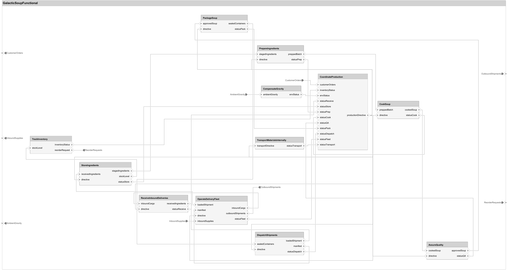

The physical layer is where it gets interesting.

## Three ways to build a soup factory

If trade studies aren't your daily work, the whole idea fits in a sentence: develop several genuinely different candidates far enough to measure them, evaluate them against the same criteria, and choose one for reasons you can defend with numbers. It's how you buy your objectivity before you've spent it. The key ingredient is alternatives that are actually different, not one design with three coats of paint, so I asked the agent for variants that each optimize a different corner of the requirement space:

**HyperCook** chases throughput: four parallel continuous cook lines, rated at 320 bowls per hour, 60% above the requirement.

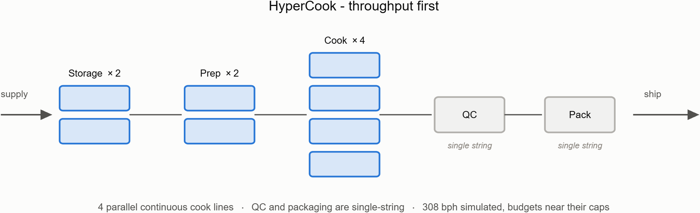

**LeanBroth** chases budget margin: two batch kettles, one prep station, more humans in the loop, roughly half of every budget unspent.

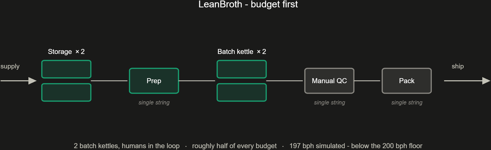

**EverSimmer** chases resilience: three fully independent production cells, each a complete prep-cook-QC-pack chain. Lose any single cell and you still make soup.

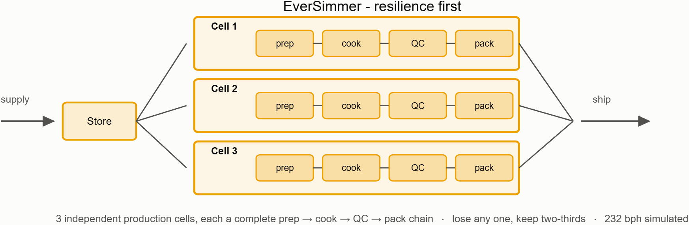

The production cell is my favorite part: a composite component with a miniature production chain inside, which System Composer's hierarchy handles naturally.

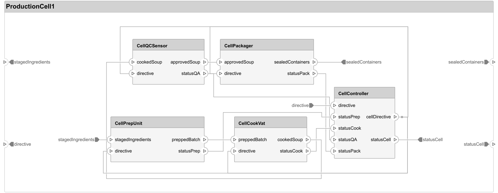

One design decision worth pausing on: these are three separate architecture models, not variant components in one model. The variants differ in topology, hierarchy depth, and component count, and each needs its own allocation set and roll-up. Three models sharing one interface dictionary and one stereotype profile turned out much cleaner, and that reasoning went into an ADR-style decision log (thirty-four entries by the end of this post), the single most useful artifact for picking work back up weeks later.

## Making the variants measurable

Every component in every variant carries the same eleven-property stereotype (mass, power, cost, throughput capacity, MTBF, and so on), so one PostOrder roll-up function works everywhere, nested cells included. Two metrics resisted the roll-up: throughput is a bottleneck problem, not a sum (a chain runs at its slowest stage; parallel units add), so each variant's stage topology lives in a small table. And the budget caps are parsed out of the requirement text at analysis time rather than hard-coded, so a requirements change propagates with zero code edits.

## Running the trade

All three variants pass all eight requirement gates, which stops being surprising once you realize a trade study where two variants fail outright is a victory lap, not a study. The information is in the margins: HyperCook passes power at 99.6% of budget, LeanBroth passes automation at exactly the floor, EverSimmer is comfortable everywhere except a 4.7% cost margin.

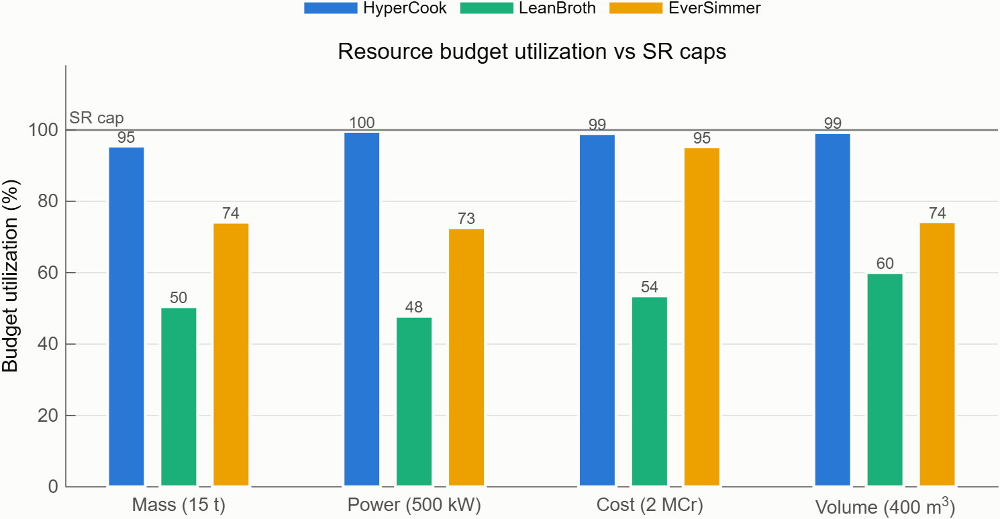

For scoring we used MCDA, which is the weighted decision matrix you already know from picking a motor: score each option per criterion, normalize, weight, sum. The value is being forced to state criteria and weights out loud, since those are where opinion sneaks in. We scored seven criteria under four named stakeholder weightings, then, because four hand-picked weight vectors are still four opinions, drew 5,000 random weightings and counted wins.

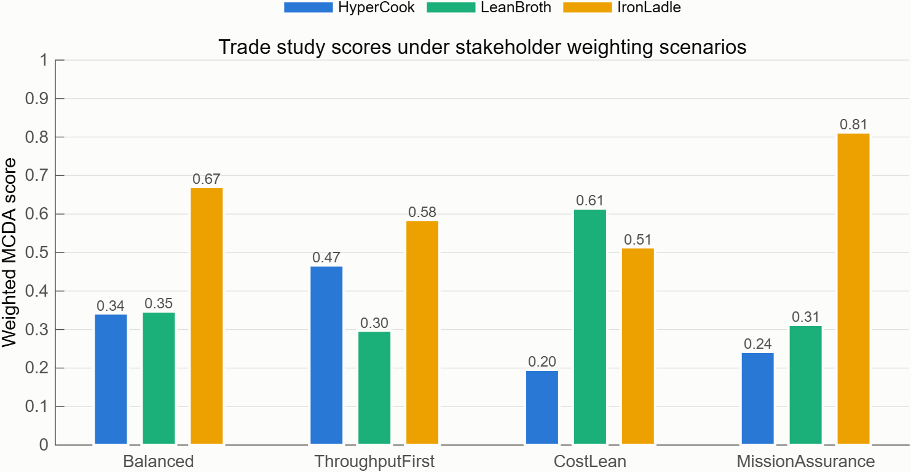

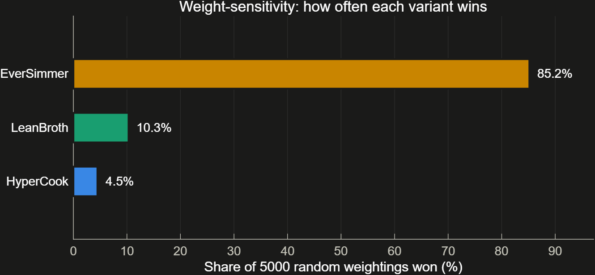

EverSimmer takes three of four scenarios and 84% of all possible stakeholder priorities, which turns "the committee picked EverSimmer" into "EverSimmer is robust to whatever the committee thinks." That was where the study stood: three compliant variants, one robust winner. Then I asked for more fidelity, and one of those claims stopped being true.

## Giving the factory a pulse

Everything so far treats the factory as a spreadsheet: rated capacities, lossless flows, nothing ever heats up or breaks. The next ask: behavioral models in Simulink, Stateflow, and Simscape, and a rerun of the trade on simulated numbers.

The part that changed my mind about where simulation should live: a separate plant model duplicates topology the architecture connectors already encode, so every component got an inline behavior inside the System Composer model, wired to its existing ports. The architecture *is* the simulation. The controller computes power and plant mode from the status buses it already receives, and throughput reads off the same shipping port the roll-up used.

My favorite component is the batch cook vat: a Stateflow chart sequences Fill-Heat-Simmer-Drain and drives a small Simscape thermal network. Nobody types in a throughput number; it emerges from batch size and physics.

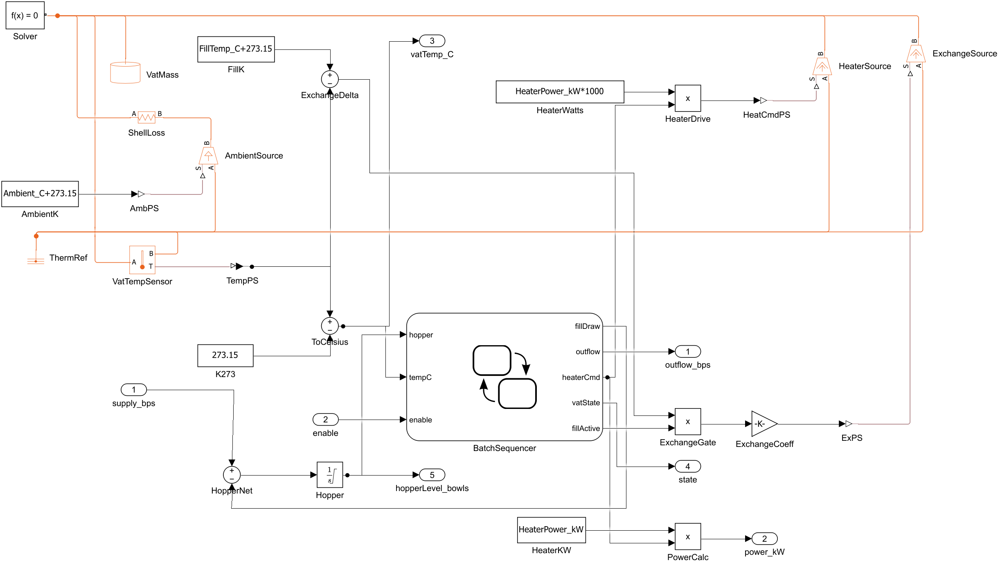

Simulation immediately showed what static roll-ups can't: HyperCook ships its first bowl 119 seconds after cold start, the batch variants take about 57 minutes, and an early run silently lost most of a 40-bowl batch as it drained into a rate-limited QC station. Real plants put surge tanks between batch and continuous stages; now so do we.

## The trade study, rerun

Here's the twist: with yield loss and calibration downtime in the model, LeanBroth produces 196.8 bowls per hour against a floor of 200. Its comfortable static margin was an artifact of lossless flow, and the compliance gate flags exactly that check. Under the rule we'd already set (a non-compliant variant has no business being scored), LeanBroth is excluded, and EverSimmer takes every scenario and 98.4% of the Monte Carlo draws.

The fault runs corrected an assumption too: HyperCook's single string is its QC scanner, not the conveyor, because the architecture never put a conveyor on the material path. At two hours in, each variant loses its worst component: HyperCook and LeanBroth collapse to zero, EverSimmer reports Degraded and settles at 67%. We had claimed that number in a spreadsheet for months; now there's a time history of it.

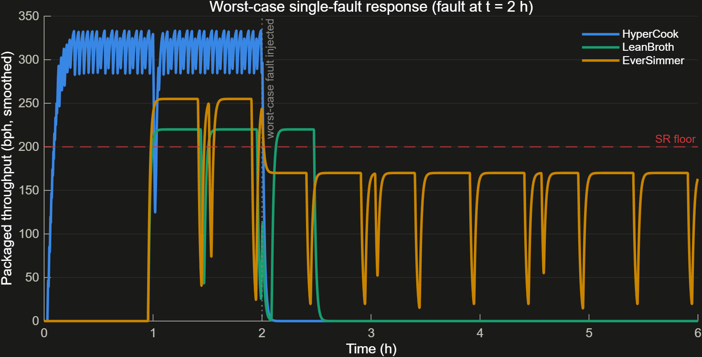

Honest caveats: the reject fractions and calibration schedules are my engineering estimates, and a better QC bench puts LeanBroth back over the floor, so the real output is a redesign study. The behavioral layer also produced new discriminators, like energy per bowl (LeanBroth best, HyperCook worst). More fidelity doesn't just check old numbers; it generates new arguments.

## Putting error bars on the physics

That "engineering estimates" caveat nagged at me, because the Monte Carlo sweep above only varies *opinions*: 5,000 random stakeholder weightings re-scoring the same fixed metrics, no simulation involved. LeanBroth's verdict was hanging on parameters I had guessed. So the next ask was a second Monte Carlo over the parameters themselves: 200 Latin hypercube draws of each variant's QC reject fraction and calibration schedule (right-skewed distributions, because rejects and maintenance overruns have long bad tails), with all three variants experiencing the same draw each time so the comparison stays fair. That's 600 actual simulations of the architecture models, dispatched through parsim in about 35 minutes, with the overrides injected per run so nothing on disk changes.

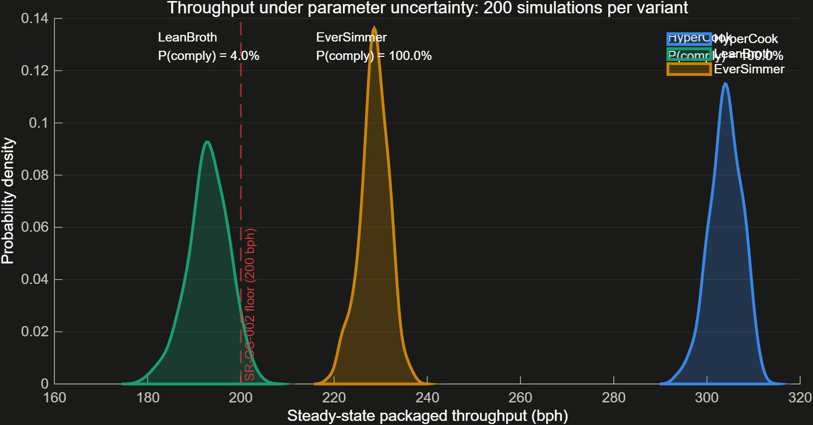

The result turns a point verdict into a probability: LeanBroth misses the 200 bowls-per-hour floor in 96% of parameter worlds, and even its 95th-percentile world reaches only 199.7. Saying "LeanBroth fails the throughput requirement with 96% confidence over the stated parameter uncertainty" is both a stronger and a fairer claim than "196.8 at nominal," because the remaining 4% quantifies exactly the better-QC-bench scenario the caveat could only gesture at. The other question was whether the winner was hiding in the error bars, so we scored every parameter draw under 25 random weightings each, with the compliance gate applied per draw: EverSimmer takes 97.8% of 5,000 worlds uncertain in both physics and priorities, barely moved from 98.4% under priorities alone. The verdict is robust to what we don't know, in both of the ways we don't know it.

## Testing the evidence, not just the models

By now the project was full of claims (golden totals, an expected gate verdict, a deterministic Monte Carlo result) that lived as assertions inside the very scripts that produced them. So they became a test suite: 37 tests in four tiers, from component unit tests up through full architecture simulations, with the expected values recorded as regression baselines so that drift must be a conscious edit, never silence. The suite earned its keep on its first run, when the golden-totals test caught stale LeanBroth numbers that had already leaked into a documentation table. It didn't catch the models being wrong; it caught *us* being wrong about the models.

The best part came from mixing test frameworks. MATLAB tests can't be linked to requirements programmatically in R2026a, but Simulink Test cases can, so the simulation tier moved into a generated Simulink Test file whose cases carry Verify links, attached deliberately: LeanBroth's cases stay unlinked regression baselines, because a green test must not vouch for a floor the design genuinely misses. The payoff is the Requirements Editor's Verified column turning green from a headless run. And instead of a code coverage report (circular, when the tests exercise the code that computes the values they assert), the suite now ends with requirements coverage: at that point in the story, 28 of 28 requirements implemented, 8 checked by the executable gate, 2 verified by executed tests, and 26 open verification slots as an honest to-do list.

runFullAnalysis regenerates the study's current numbers, runAllTests holds every number in this post as a regression baseline (including the superseded ones, retained as labeled what-ifs), and the Requirements Editor shows the receipts.

## The requirement nobody had exercised

One requirement had been green on paper since the first post and touched by nothing since: operate from 0.1 g to 12 g. Every variant even carries a gravity-compensation component; no analysis had ever asked it to compensate. So gravity went into the behaviors, with the physics kept where it's defensible: batch vats drain at the speed gravity gives them (a square-root law, so microgravity drains take three times longer), robotic prep derates gently at high g, human-paced prep derates three times faster, and pumped continuous cook lines don't care at all. Everything is exactly neutral at 1 g, so every baseline in the test suite still stands. Then a sweep across the full range, and the requirement stopped being green:

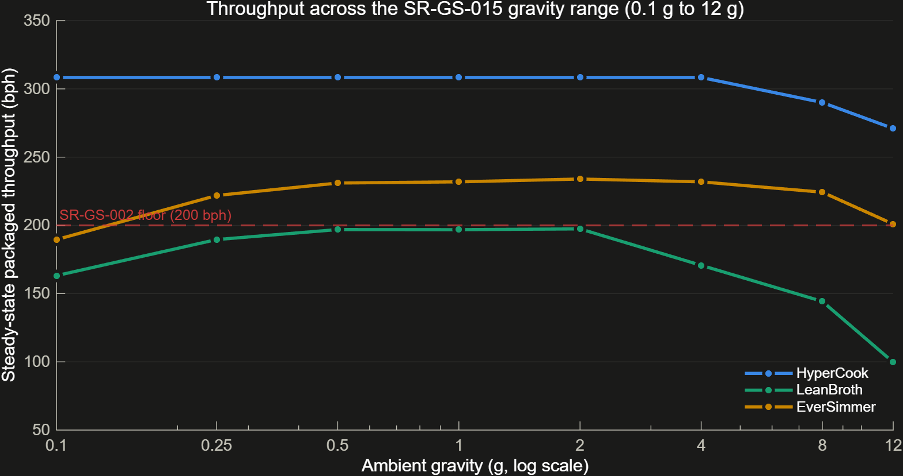

EverSimmer, the trade winner, the variant that survives any single fault, fails at 0.1 g: 189 bowls per hour against the 200 floor, because slow-draining vats are exactly the wrong technology for microgravity. Only HyperCook holds the floor across the whole range, so only HyperCook earned Verify links to the gravity requirement; EverSimmer's shortfall is baselined as an unlinked regression case and a redesign flag (pump-assisted drains). And while wiring up the new test criteria, the serving-temperature check failed on its first run and caught a second design flaw: the vat targeted 95 C, the top of the required 70-95 C serving band, and control ripple served soup at 95.2. The fix was design margin (target 94), not test tolerance. Requirements verified by executed tests went from 2 to 5, and both findings came from asking the models questions the spreadsheet never could.

That exercise became the pattern: find a requirement implemented on paper but exercised by nothing, wire in physics that changes nothing at nominal, sweep the design space, and link only where a passing test honestly means met. Five more requirements went through it. Contamination detection swept clean, with a boundary case proving a detector specified at the 99% floor meets it with zero margin, which is exactly why the design value is 99.5%. Transport loading picked up dock queues fed by parameters nobody had ever used, plus a capacity margin cliff with LeanBroth standing nearest the edge. Runtime recipe selection produced my favorite reversal: continuous lines pay flush downtime for every changeover while batch vats hide it in the clean phase they already have, so recipe flexibility is where batch cooking finally wins one. Rocket turnaround caught LeanBroth missing the 20-minute limit by 41 seconds at the design shipment size. And storage endurance got the first hard no: 4 to 6 hours of ingredients against a required 72, with compliance priced at 8 to 12 tonnes of ingredients against a 15-tonne mass budget, a genuine requirements conflict sent back to its owner with numbers attached.

The owner's ruling, consumables excluded from the mass budget, is my favorite chapter of the study. The stores were resized to a true 72 hours, and the finding's baselines, built to assert the failure precisely so a fix would have to retire them deliberately, were retired deliberately. Then the bill arrived: racks for 20,000 bowls still weigh, cost, and occupy, and HyperCook's razor-thin margins could not pay. It dropped out of compliance entirely, leaving EverSimmer the only variant standing and the trade study a documented forced selection. Resolving one requirement moved the non-compliance somewhere else, and the models watched it happen end to end.

Requirements verified by executed simulation stand at 10 of 28, each with its own design-space sweep, the suite has grown to 72 tests, and every sweep paid for itself with either a margin number nobody had or a finding nobody expected.

## Working with the agent, this time

My April post described a propose-approve-generate-run-confirm loop, with me in the middle of every step. That is not how this project went, and I'd be misleading you to pretend otherwise. With the current generation of agent I described outcomes, and it worked in long autonomous stretches: building models, running simulations, writing and executing its own tests, farming documentation to sub-agents, and committing when things were green. My involvement moved up a level, from approving steps to reviewing artifacts and making the calls that were genuinely mine: choosing the variant philosophies, renaming one of them, deciding what a Verify link is allowed to assert, insisting the diagrams be readable.

A few observations from that mode of working:

**The agent's tests catch the agent.** The regression baselines flagged the agent's own stale numbers within minutes of existing. When the agent works autonomously, self-built verification isn't a nice-to-have; it's the thing that makes autonomy safe.

**Standing preferences beat repeated corrections.** I told it once that I use "regression baseline," not other jargon, and once that em dashes are banned from my posts. Both became durable memory, enforced across every artifact since, including this one.

**You still take the wheel, just less often and higher up.** The verification-status mystery that stumped the agent's headless debugging was cracked by one interactive experiment I ran in the Test Manager in under a minute. Knowing when a human hand is the cheaper instrument is still an engineering skill.

**Make it write everything down.** The decision log, the gotcha files, the skills it maintains for itself: the agent that documents its own wrong turns doesn't repeat them, and neither do I.

## So what's the point?

Same answer as last time, with more conviction. What changed my mind about the ceiling of this approach is that the agent made it *cheap to compare alternatives properly*, and then cheap to climb the fidelity ladder: three full architectures with allocation, traceability, and sensitivity-checked scoring, then behavioral models that overturned a compliance verdict, each a follow-up request rather than a program phase. When raising the fidelity of your evidence is cheap, you find out a margin was fictional while it's still a design decision instead of a program review. The engineering judgment didn't go anywhere; it just got to spend its time on judgment.

## Now it's your turn

The full project (architectures with inline behavior, the component library, requirements, analysis, tests, and all thirty-four ADRs) is in the repo linked below, along with the skills from the first post. Clone it, run runFullAnalysis, run runAllTests, and check my math. Then tell your agent you want a fourth variant and see what it proposes.

Have you tried running an architecture trade study with an AI agent in the loop? Where did it help, and where did you have to take the wheel? Let us know in the comments.
